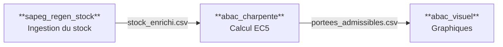
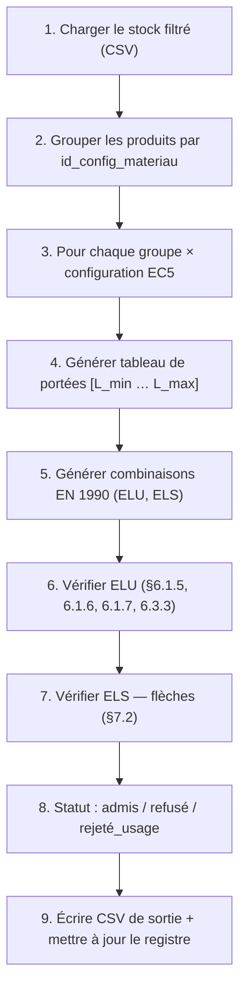

# Comprendre ABAC-Charpente
## Guide Socratique du Code

*De Python aux vérifications Eurocode 5, expliqué pas à pas comme si tu ne savais rien*

---

> « Je ne sais qu'une chose, c'est que je ne sais rien. »
> — Socrate

*Document d'usage personnel — 2026*

---

## Table des matières

- [Avant-propos](#avant-propos)
- [Chapitre 1 — Python : les briques de base](#chapitre-1--python--les-briques-de-base)
- [Chapitre 2 — L'architecture du projet](#chapitre-2--larchitecture-du-projet)
- [Chapitre 3 — Les données d'entrée](#chapitre-3--les-données-dentrée)
- [Chapitre 4 — Le moteur de calcul EC5](#chapitre-4--le-moteur-de-calcul-ec5)
- [Chapitre 5 — Les sorties](#chapitre-5--les-sorties)
- [Conclusion](#conclusion)

---

## Avant-propos

Ce document est un guide pédagogique du logiciel **ABAC-Charpente** (*Abaque de Calcul pour Charpentes en Bois*), un outil de calcul automatique de portées admissibles pour les structures bois, conformément aux normes européennes EN 1990 et EN 1995 (Eurocode 5).

La méthode pédagogique choisie est le **dialogue socratique** : plutôt qu'asséner des définitions, le Maître pose des questions qui amènent l'Apprenti à découvrir les concepts par lui-même. Tu trouveras tout au long de ce document des échanges entre ces deux personnages :

> **Maître** — Les questions du Maître t'invitent à réfléchir avant que la réponse ne soit donnée.

> **Apprenti** — Les réponses de l'Apprenti — parfois hésitantes — modélisent le cheminement naturel d'un ingénieur qui découvre Python.

> **Point clé** — Les encadrés verts résument les points clés à retenir absolument.

> **Définition** — Les encadrés oranges définissent les termes techniques importants (Python ou Eurocode).

**Comment lire ce document ?**
Tu peux le parcourir linéairement pour une compréhension complète. Les exemples de code sont systématiquement tirés de l'application réelle. Les numéros de fichiers mentionnés correspondent à la structure du projet telle qu'elle existe sur le disque.

---

## Chapitre 1 — Python : les briques de base

Avant d'entrer dans le cœur du logiciel, il faut parler le même langage. Ce chapitre t'apprend Python à travers les yeux d'un charpentier.

### 1.1 Les variables : nommer les choses

> **Maître** — Quand tu dessines un plan de charpente, tu notes des dimensions. Comment tu notes la largeur d'une section de bois ?

> **Apprenti** — Je note « b = 63 mm ».

> **Maître** — Exactement. En Python, c'est presque identique :

```python
b_mm = 63.0      # largeur de section, en millimètres
h_mm = 175.0     # hauteur de section, en millimètres
L_max_m = 6.0    # portée maximale, en mètres
```

> **Définition** — Une **variable** est une boîte dans la mémoire de l'ordinateur, à laquelle on donne un nom. Le signe `=` ne veut pas dire « est égal » au sens mathématique, mais « reçoit la valeur ». Autrement dit : `b_mm = 63.0` se lit « la boîte nommée `b_mm` reçoit la valeur `63.0` ».

Tu remarques que les noms de variables dans ce code portent l'unité (`_mm`, `_m`, `_MPa`, `_kNm`). C'est une convention délibérée du projet, appelée **Principe VI**, pour éviter de confondre mètres et millimètres — une erreur qui a causé plus d'un problème structurel dans l'histoire de l'ingénierie.

> **Maître** — Et si j'écris `b_mm = 63` au lieu de `b_mm = 63.0`, c'est la même chose ?

> **Apprenti** — Je pense que oui, 63 et 63,0 c'est pareil, non ?

> **Maître** — Presque. Mais Python distingue les types de données : `63` est un entier (`int`), et `63.0` est un décimal (`float`). En pratique, pour les grandeurs physiques, on utilise toujours `float` car les calculs comme σ = M / W donnent des résultats décimaux.

### 1.2 Les types de données

Python distingue plusieurs *types* de données :

| Type Python | Ce que c'est | Exemple dans le projet |
|---|---|---|
| `int` | Nombre entier | `classe_service = 1` |
| `float` | Nombre décimal | `f_m_k_MPa = 24.0` |
| `str` | Texte (chaîne) | `classe_resistance = "C24"` |
| `bool` | Vrai ou Faux | `double_flexion = True` |
| `list` | Liste d'éléments | `pentes_deg = [4, 15, 30, 45]` |
| `dict` | Table clé → valeur | `{"b_mm": 63, "h_mm": 175}` |

```python
# float : grandeurs physiques avec unité dans le nom
b_mm = 63.0
f_m_k_MPa = 24.0        # résistance caractéristique en flexion (MPa)

# str : identifiants et classifications
classe_resistance = "C24"
type_poutre = "Panne"
usage = "TOITURE_INACC"

# bool : options oui/non
double_flexion = True
second_oeuvre = False

# list : plusieurs valeurs à tester (expansion cartésienne)
pentes_deg = [4, 15, 30, 45]      # 4 pentes à calculer

# dict : propriétés regroupées en une seule structure
section = {
    "b_mm": 63.0,
    "h_mm": 175.0,
    "classe": "C24"
}
```

> **Maître** — Pourquoi avoir une liste de pentes `[4, 15, 30, 45]` plutôt qu'une seule valeur ?

> **Apprenti** — Parce que le logiciel doit calculer pour plusieurs pentes de toiture différentes ?

> **Maître** — Exactement. Et c'est là qu'intervient l'un des concepts les plus puissants de ce logiciel : on peut donner des listes de paramètres, et le programme génère automatiquement toutes les combinaisons. Mais n'anticipons pas — voyons d'abord les fonctions.

### 1.3 Les fonctions : des recettes de calcul réutilisables

> **Maître** — Dans ton travail d'ingénieur, tu appliques souvent la même formule à des données différentes. Par exemple, le moment d'inertie d'une section rectangulaire : I = bh³/12. Tu la recalcules à chaque fois depuis zéro ?

> **Apprenti** — Non, je la note une fois dans mon tableur et je change juste les valeurs de b et h.

> **Maître** — En Python, on fait pareil avec les **fonctions**.

```python
# --- Définition : on écrit la "recette" une seule fois ---
def calculer_inertie(b_mm: float, h_mm: float) -> float:
    """Moment d'inertie en cm4 d'une section rectangulaire b x h."""
    I_mm4 = b_mm * h_mm**3 / 12.0    # mm4  (**3 = puissance 3)
    I_cm4 = I_mm4 / 1e4              # conversion mm4 -> cm4
    return I_cm4                      # renvoie le résultat

# --- Appel : on "invoque" la recette avec des valeurs ---
I_A = calculer_inertie(63.0, 175.0)    # -> 28013 cm4
I_B = calculer_inertie(75.0, 225.0)    # -> 71367 cm4
```

Décortiquons ce code ligne par ligne :

- `def` est le mot-clé Python qui signifie « je définis une fonction ».
- `calculer_inertie` est le nom qu'on lui donne (en français, conforme au Principe IX du projet).
- `b_mm: float, h_mm: float` sont les **paramètres** (les ingrédients de la recette). Le `: float` indique le type attendu : c'est une annotation de type, facultative mais très lisible.
- `-> float` indique ce que la fonction retourne.
- Les triples guillemets `"""..."""` sont la **docstring** : une documentation intégrée, lisible par les outils de développement.
- `return` renvoie le résultat au code appelant.

> **Point clé** — L'indentation (les espaces en début de ligne) est **obligatoire** en Python. Elle délimite le contenu de la fonction. Si tu oublies de l'indenter, Python lève une erreur immédiatement.

Voici la vraie fonction de calcul de section dans le code (`ec5/proprietes.py`) :

```python
def calculer_section(b_mm: float, h_mm: float) -> dict:
    """Calcule les propriétés géométriques d'une section rectangulaire.

    Retourne un dictionnaire avec :
        A_cm2   : aire en cm²
        I_cm4   : inertie axe fort en cm⁴
        W_cm3   : module de résistance axe fort en cm³
        I_z_cm4 : inertie axe faible en cm⁴
        W_z_cm3 : module de résistance axe faible en cm³
    """
    A_mm2   = b_mm * h_mm
    I_mm4   = b_mm * h_mm**3 / 12.0
    W_mm3   = b_mm * h_mm**2 / 6.0
    I_z_mm4 = h_mm * b_mm**3 / 12.0   # axe faible : b et h sont inversés
    W_z_mm3 = h_mm * b_mm**2 / 6.0

    return {
        "A_cm2":   A_mm2  / 100.0,
        "I_cm4":   I_mm4  / 1e4,
        "W_cm3":   W_mm3  / 1e3,
        "I_z_cm4": I_z_mm4 / 1e4,
        "W_z_cm3": W_z_mm3 / 1e3,
    }
```

> **Maître** — Pourquoi la fonction retourne un `dict` plutôt que de retourner `A_cm2` directement ?

> **Apprenti** — Parce qu'on veut récupérer plusieurs valeurs à la fois ?

> **Maître** — Exactement. En Python, une fonction ne peut retourner qu'une seule « chose », mais cette chose peut être un dictionnaire qui en contient plusieurs. C'est un idiome très courant dans ce code : toutes les fonctions de vérification EC5 retournent un dictionnaire de valeurs intermédiaires.

### 1.4 Les listes et les boucles : travailler en série

> **Maître** — Imaginons que tu doives vérifier une poutre pour des portées de 2 m, 2,5 m, 3 m… jusqu'à 6 m. Comment tu ferais manuellement ?

> **Apprenti** — Je ferais le calcul pour 2 m, puis pour 2,5 m, puis pour 3 m… Ça fait beaucoup de lignes.

> **Maître** — Python te permet de l'écrire une seule fois et de le répéter automatiquement avec une **boucle**.

```python
import numpy as np

# Génération d'un tableau de portées : de 2.0 à 6.0, par pas de 0.5
longueurs_m = np.arange(2.0, 6.5, 0.5)
# Résultat : array([2.0, 2.5, 3.0, 3.5, 4.0, 4.5, 5.0, 5.5, 6.0])

# Boucle : on répète le bloc indenté pour chaque valeur de L
for L in longueurs_m:
    w_inst = 5 * 1.2 * L**4 / (384 * 11000 * 2800)  # formule simplifiée
    print(f"L = {L:.1f} m  ->  w_inst = {w_inst:.2f} mm")
```

> **Définition** — **numpy** (importé sous le nom `np`) est une bibliothèque externe qui ajoute des capacités de calcul scientifique à Python. `np.arange(2.0, 6.5, 0.5)` génère un tableau de nombres de 2,0 à 6,0 (6,5 exclu) avec un pas de 0,5. C'est l'équivalent Python d'une colonne de tableau dans Excel.

Voici le code réel du moteur de calcul (`moteur.py`) :

```python
# L_min, pas, L_max viennent de la configuration et du produit
L_min = float(config.L_min_m)
pas   = float(config.pas_longueur_m)
L_max = p_rep.L_max_m   # portée max du produit (ex : 6.0 m)

# Génération du tableau de toutes les portées à tester
longueurs_m = np.arange(L_min, L_max + pas / 2, pas)
#              ^--- début    ^--- fin (+marge)  ^--- pas

# Note : le "+ pas/2" est une précaution technique.
# np.arange peut parfois manquer la borne finale à cause des
# imprécisions des nombres décimaux (6.0 devient 5.999...).
# En ajoutant la moitié du pas, on s'assure de bien inclure L_max.
```

### 1.5 Les conditions : prendre des décisions

```python
taux_determinant = 0.87   # résultat d'un calcul EC5

# Cas simple : admis ou refusé
if taux_determinant <= 1.0:
    statut = "admis"    # la poutre résiste
else:
    statut = "refusé"   # la poutre est insuffisante

# Cas avec plusieurs branches (elif = "sinon si")
if taux_determinant <= 0.80:
    commentaire = "large marge de sécurité"
elif taux_determinant <= 1.00:
    commentaire = "marge de sécurité acceptable"
else:
    commentaire = "section insuffisante"
```

Dans le code réel (`moteur.py`), la décision est légèrement plus nuancée :

```python
statut_usage = els.get("statut_usage", "ok")

if statut_usage == "rejeté_usage":
    statut = "rejeté_usage"   # usage non supporté (ex : plancher dalle)
elif taux_determinant <= 1.0:
    statut = "admis"
else:
    statut = "refusé"
```

### 1.6 Les dictionnaires : des fiches produit

> **Maître** — Dans ton catalogue bois, une fiche produit contient le libellé, les dimensions, la classe de résistance… Comment tu organiserais ça en Python ?

> **Apprenti** — Je mettrais tout dans une sorte de tableau avec des étiquettes ?

> **Maître** — Exactement : c'est un **dictionnaire** (`dict`).

```python
produit = {
    "id_produit":         "EPX-063-175-6000",
    "b_mm":               63.0,
    "h_mm":               175.0,
    "L_max_m":            6.0,
    "classe_resistance":  "C24",
    "famille":            "bois_massif",
    "disponible":         True,
}

# Lecture d'une valeur par sa clé
hauteur   = produit["h_mm"]       # -> 175.0
est_dispo = produit["disponible"] # -> True

# Vérification de l'existence d'une clé
if "fournisseur" in produit:
    print(produit["fournisseur"])
else:
    print("Pas de fournisseur renseigné")
```

Dans le code réel, les fonctions de vérification EC5 retournent des dictionnaires avec toutes les valeurs intermédiaires du calcul :

```python
def calculer_flexion(...):
    # ... calculs ...
    return {
        "f_m_d_MPa":       ...,  # résistance de calcul
        "sigma_m_MPa":     ...,  # contrainte calculée
        "taux_flexion_ELU": ..., # ratio de sollicitation (doit être <= 1.0)
    }
```

### 1.7 Les classes : modéliser les types de poutres

C'est ici que Python devient vraiment puissant. Jusqu'ici, on a manipulé des valeurs et des fonctions isolées. Les **classes** permettent de regrouper des données *et* des comportements dans une même entité.

> **Maître** — Pense à une panne de toiture et à une solive de plancher. Elles ont toutes les deux une largeur, une hauteur, une portée… Mais comment sont calculées leurs charges ?

> **Apprenti** — Différemment ! La panne subit les charges en biais à cause de la pente du toit, tandis que la solive est horizontale.

> **Maître** — Voilà exactement pourquoi ce code utilise des classes. Regarde comment est définie la classe abstraite de base.

```python
# Extrait de types_poutre/base.py
from abc import ABC, abstractmethod   # ABC = Abstract Base Class
import numpy as np

class TypePoutre(ABC):
    """Classe abstraite représentant un type de poutre bois.

    Toute sous-classe DOIT implémenter charges_lineaires().
    INTERDIT : if/match sur le type dans elu.py / els.py.
    """

    @abstractmethod
    def charges_lineaires(self, config, materiau, longueurs_m, combi):
        """Calcule les charges linéaires (kN/m) pour chaque portée.

        Cette méthode n'a PAS de code ici : c'est un "contrat".
        Chaque sous-classe (Panne, Solive, etc.) doit l'implémenter.
        """
        ...   # les "..." signifient : pas d'implémentation ici

    def longueur_deversement_m(self, longueur_m, entraxe_antideversement_mm):
        """Longueur de déversement (méthode COMMUNE à tous les types).

        Règle (EF-024) :
            pas d'anti-déversement  -> L_ef = L
            L <= 2 * entraxe        -> L_ef = L / 2
            L >  2 * entraxe        -> L_ef = entraxe
        """
        if entraxe_antideversement_mm <= 0:
            return longueur_m
        a_m = entraxe_antideversement_mm / 1000.0   # mm -> m
        if longueur_m <= 2 * a_m:
            return longueur_m / 2.0
        return a_m
```

> **Définition** — **ABC** signifie *Abstract Base Class* (classe de base abstraite). Une classe abstraite est un *contrat* : elle dit « toute sous-classe doit implémenter ces méthodes », sans fournir l'implémentation elle-même. Le décorateur `@abstractmethod` marque les méthodes obligatoires.

Ensuite, chaque type de poutre hérite de cette classe et implémente sa propre logique de charges. Voici la classe `Panne` simplifiée :

```python
import math
import numpy as np

class Panne(TypePoutre):
    """Panne de toiture inclinée.

    Hérite de TypePoutre et implémente charges_lineaires()
    en tenant compte de la pente.
    """

    def charges_lineaires(self, config, materiau, longueurs_m, combi):
        pente_rad = math.radians(config.pente_deg)
        entraxe_m = config.entraxe_m

        # Charges surfaciques (kN/m²) -> charges linéaires (kN/m)
        g_kNm2 = config.g_k_kNm2 + materiau.poids_propre_kNm2  # permanent
        s_kNm2 = config.s_k_kNm2                                # neige

        # Projection : les charges permanentes s'exercent sur la surface
        # inclinée, donc on les divise par cos(alpha) pour ramener
        # à la surface projetée horizontale
        g_inclinee = g_kNm2 / math.cos(pente_rad)

        q_G = g_inclinee * entraxe_m   # kN/m (par mètre de portée)
        q_S = s_kNm2 * entraxe_m       # kN/m (neige = charge verticale)

        # Combinaison EN 1990 (coefficients venant de "combi")
        q_d = combi.gamma_G * q_G + combi.gamma_Q1 * q_S

        # Moment et effort tranchant (poutre simplement appuyée)
        M_d = q_d * longueurs_m**2 / 8.0    # kN.m
        V_d = q_d * longueurs_m / 2.0       # kN

        return {
            "q_G_kNm": q_G * np.ones_like(longueurs_m),
            "q_S_kNm": q_S * np.ones_like(longueurs_m),
            "q_d_kNm": q_d * np.ones_like(longueurs_m),
            "M_d_kNm": M_d,
            "V_d_kN":  V_d,
        }

    def decomposer(self, charges_kNm, pente_rad):
        q_y = charges_kNm * math.cos(pente_rad)  # axe fort
        q_z = charges_kNm * math.sin(pente_rad)  # axe faible
        return q_y, q_z
```

> **Point clé** — C'est le **polymorphisme** : les modules de calcul EC5 (`elu.py`, `els.py`) appellent toujours `type_poutre.charges_lineaires()` sans savoir si c'est une Panne, une Solive ou un Chevron. Chaque sous-classe répond à sa façon. C'est élégant et extensible : ajouter un nouveau type de poutre ne nécessite de modifier *que* la nouvelle classe, sans toucher aux calculs EC5.

### 1.8 Les modules et les imports

> **Maître** — On voit souvent `import numpy as np`, `import pandas as pd`… C'est quoi ces imports ?

> **Apprenti** — Ce sont des bibliothèques extérieures qu'on charge ?

> **Maître** — Exactement. Imagine que tu travailles sur un chantier. Tu n'emportes pas tous tes outils chaque matin — tu charges seulement ce dont tu as besoin pour la journée. Les imports, c'est pareil.

```python
import numpy as np          # calcul numérique (tableaux, maths)
import pandas as pd         # manipulation de tableaux de données CSV
from pathlib import Path    # gestion propre des chemins de fichiers
import math                 # fonctions mathématiques (sin, cos, sqrt...)
from loguru import logger   # affichage de messages de log

# Import depuis un sous-module du projet lui-même
from abac_charpente.ec5.elu import verifier_elu
from abac_charpente.ec0.combinaisons import generer_combinaisons
```

Les bibliothèques clés de ce projet :

| Bibliothèque | Rôle |
|---|---|
| `numpy` | Calcul numérique vectorisé (tableaux, maths) |
| `pandas` | Lecture/écriture CSV, manipulation de données |
| `click` | Interface ligne de commande |
| `pydantic` | Validation automatique des données de configuration |
| `loguru` | Affichage de messages (info, avertissement, erreur) |
| `matplotlib` | Génération de graphiques (module `abac_visuel`) |

---

## Chapitre 2 — L'architecture du projet

### 2.1 Vue d'ensemble : trois modules indépendants

Le projet est découpé en trois sous-packages indépendants :



Cette séparation suit un principe fondamental en informatique : chaque module a une **responsabilité unique**. Comme en charpente, on sépare les corps d'état — le charpentier, le couvreur, le plaquiste — chacun fait son travail de façon autonome.

### 2.2 Structure des fichiers

```
CAB_Chapente/
│
├── config.toml               <- Configuration principale
├── configs_calcul.toml       <- Scénarios de calcul EC5
├── configs_filtre.toml       <- Règles de filtrage du stock
├── ALL_PRODUIT_*.csv         <- Stock bois (export SAPEG)
│
├── src/
│   ├── abac_charpente/
│   │   ├── cli.py            <- Point d'entrée (ligne de commande)
│   │   ├── moteur.py         <- Orchestrateur principal
│   │   ├── config.py         <- Lecture de la configuration TOML
│   │   ├── registre.py       <- Cache de calculs (registre incrémental)
│   │   ├── ec0/
│   │   │   └── combinaisons.py  <- EN 1990 : combinaisons d'actions
│   │   ├── ec1/
│   │   │   ├── neige.py      <- EN 1991 : charges de neige
│   │   │   └── vent.py       <- EN 1991 : charges de vent
│   │   ├── ec5/
│   │   │   ├── elu.py        <- Etats Limites Ultimes (§6.1.x, §6.3.x)
│   │   │   ├── els.py        <- Etats Limites de Service (§7.2)
│   │   │   ├── double_flexion.py  <- Flexion biaxiale (§6.1.6)
│   │   │   ├── proprietes.py <- Tables kmod, kdef, gamma_M, EN 338
│   │   │   └── types_poutre/ <- Panne, Solive, Chevron, Sommier
│   │   └── data/             <- Tables normatives (CSV)
│   │       ├── materiaux_bois.csv    <- EN 338 : propriétés des classes
│   │       ├── kmod.csv              <- EC5 Tableau 3.1
│   │       ├── kdef.csv              <- EC5 Tableau 3.2
│   │       ├── gamma_m.csv           <- EC5 §2.4
│   │       └── limites_fleche_ec5.csv <- EC5 §7.2
│   │
│   ├── sapeg_regen_stock/    <- Pipeline stock SAPEG
│   └── abac_visuel/          <- Génération de graphiques
│
└── resultats/                <- Sorties (créées automatiquement)
    ├── portees_admissibles.csv
    ├── stock_enrichi.csv
    └── registre_calcul.csv
```

### 2.3 Le point d'entrée : la ligne de commande

Le programme se lance avec :

```
uv run abac calculer --config config.toml
```

> **Maître** — Comment Python sait-il quoi faire quand on tape cette commande ?

> **Apprenti** — Il doit y avoir un fichier qui dit : « si on appelle la commande `abac`, démarre ici » ?

> **Maître** — Oui. Ce fichier s'appelle `cli.py` et utilise la bibliothèque `Click`. Les décorateurs `@click.command` et `@click.option` transforment une fonction Python ordinaire en commande de terminal.

```python
# Extrait de cli.py
import click

@click.group()
def abac():
    """ABAC-Charpente : calcul de portées admissibles EC5."""
    pass

@abac.command("calculer")
@click.option("--config", default="config.toml",
              help="Fichier de configuration principal")
@click.option("--recalcul-complet", is_flag=True, default=False,
              help="Forcer le recalcul (ignorer le registre)")
def calculer(config, recalcul_complet):
    """Lance le calcul complet."""
    app_config = charger_config(config)
    moteur.lancer_calcul(app_config, recalcul_complet=recalcul_complet)
```

> **Définition** — Un **décorateur** (le `@` devant une fonction) est une façon d'enrober une fonction existante avec du comportement supplémentaire, sans modifier son code interne. Ici, `@click.command("calculer")` dit à Click : « la fonction suivante répond à la sous-commande `calculer` ».

### 2.4 Les modèles de données : Pydantic

> **Maître** — Imagine que quelqu'un écrit `g_k_kNm2 = "quarante"` dans le fichier de configuration au lieu de `40.0`. Comment le programme sait-il que c'est une erreur ?

> **Apprenti** — Il faut qu'il vérifie les types des données à la lecture ?

> **Maître** — Exactement. C'est le rôle de **Pydantic**. Chaque configuration est décrite par un modèle de données qui définit les types attendus. Si un fichier TOML contient une valeur du mauvais type, Pydantic lève une erreur claire avant même que les calculs commencent.

```python
# modeles/config_calcul.py
from pydantic import BaseModel

class ConfigCalcul(BaseModel):
    """Configuration d'un scénario de calcul EC5."""

    id_config_calcul: str          # identifiant unique (ex : "PANNE_INACC")
    type_poutre: str               # "Panne", "Solive", "Chevron", "Sommier"
    usage: str                     # "TOITURE_INACC", "PLANCHER_HAB", etc.

    L_min_m: float = 2.0           # portée minimale (m)
    pas_longueur_m: float = 0.5    # pas de calcul (m)

    pente_deg: float = 0.0         # pente toiture (degrés)
    entraxe_m: float = 1.0         # entraxe des poutres (m)
    classe_service: int = 1        # classe de service EC5 (1, 2 ou 3)

    g_k_kNm2: float                # charge permanente hors poids propre
    s_k_kNm2: float = 0.0          # neige (kN/m²)
    w_k_kNm2: float = 0.0          # vent (kN/m²)
    q_k_kNm2: float = 0.0          # exploitation (kN/m²)

    double_flexion: bool = False
    second_oeuvre: bool = False
    marge_securite: float = 0.0    # marge supplémentaire (0 à 1)
```

---

## Chapitre 3 — Les données d'entrée

### 3.1 Le stock bois : le fichier ALL_PRODUIT

Le stock est fourni par le logiciel SAPEG sous forme d'un fichier CSV (valeurs séparées par des `|`). Chaque ligne est un produit disponible :

```
id_produit|libelle|b_mm|h_mm|L_max_m|classe_resistance
EPX-063-175|Epicéa C24 63x175|63.0|175.0|6.0|C24
EPX-075-225|Epicéa C24 75x225|75.0|225.0|7.0|C24
GL24H-160-320|GL24h 160x320|160.0|320.0|12.0|GL24h
```

> **Maître** — Pourquoi appelle-t-on ce format « CSV » si le séparateur est `|` et non une virgule ?

> **Apprenti** — C'est une bonne question… CSV veut dire *Comma-Separated Values* mais en pratique on utilise n'importe quel séparateur ?

> **Maître** — Oui, le terme CSV est devenu générique. SAPEG utilise le pipe (`|`) car les libellés de produits peuvent contenir des virgules ou des points-virgules. C'est un choix pratique pour éviter les ambiguïtés lors de la lecture.

Le code lit ce CSV avec Pandas (`sapeg_regen_stock/chargeur.py`) :

```python
import pandas as pd

def charger_stock(chemin_csv: str) -> pd.DataFrame:
    """Charge le fichier ALL_PRODUIT CSV exporté par SAPEG."""
    df = pd.read_csv(
        chemin_csv,
        sep="|",            # séparateur pipe (pas une virgule !)
        encoding="latin-1"  # encodage SAPEG (attention aux accents !)
    )
    return df
```

> **Définition** — Un **DataFrame Pandas** est l'équivalent Python d'une feuille Excel : un tableau avec des noms de colonnes, où chaque ligne est un enregistrement. On peut filtrer, trier, calculer sur des colonnes entières en une seule instruction. Contrairement à une boucle Python, ces opérations sont très rapides car Pandas les exécute en C interne.

### 3.2 La configuration TOML

```toml
# config.toml
[stock]
repertoire = "."              # répertoire contenant ALL_PRODUIT_*.csv
filtre_calcul = "charpente"   # nom du filtre stock à utiliser

[sortie]
fichier_csv    = "resultats/portees_admissibles.csv"
registre       = "resultats/registre_calcul.csv"
stock_enrichi  = "resultats/stock_enrichi.csv"

[calcul]
fichier_configs_calcul = "configs_calcul.toml"

[calcul.defaults]
longueur_appui_mm = 50.0    # longueur d'appui par défaut (mm)
k_c90             = 1.0     # facteur compression perp. au fil
taux_cible_appui  = 0.80    # taux cible pour calcul longueur appui min
```

Le fichier `configs_calcul.toml` définit les scénarios de calcul :

```toml
[[config_calcul]]
id_config_calcul = "PANNE_TOITURE_INACC"
type_poutre      = "Panne"
usage            = "TOITURE_INACC"
L_min_m          = 2.0
pas_longueur_m   = 0.5
# Listes -> expansion cartésienne automatique
pente_deg        = [4, 15, 30, 35, 40, 45]   # 6 pentes
entraxe_m        = [1.2, 1.7]                 # 2 entraxes
g_k_kNm2         = [0.4, 0.5, 0.6, 0.7, 0.8] # 5 charges perm.
# Total : 6 x 2 x 5 = 60 configurations générées !
s_k_kNm2         = 0.36
classe_service   = 1
double_flexion   = true
marge_securite   = 0
```

> **Maître** — Tu remarques que `pente_deg` est une liste `[4, 15, 30, 35, 40, 45]`. Qu'est-ce que l'« expansion cartésienne » ?

> **Apprenti** — Le programme crée une configuration distincte pour chaque combinaison de pente, d'entraxe et de charge permanente ?

> **Maître** — Exactement. Avec 6 pentes × 2 entraxes × 5 charges permanentes, on obtient 6 × 2 × 5 = **60 configurations** à partir d'une seule entrée TOML. C'est un gain de temps considérable.

### 3.3 Les tables normatives : les CSV EC5

Le dossier `data/` contient les tables normatives de l'Eurocode 5 sous forme CSV, chargées une seule fois au démarrage :

| Fichier | Source | Contenu |
|---|---|---|
| `materiaux_bois.csv` | EN 338 | Classes C16–C50, GL24–GL32 |
| `kmod.csv` | EC5 Tab. 3.1 | Facteurs k_mod par famille/classe/durée |
| `kdef.csv` | EC5 Tab. 3.2 | Facteurs de fluage k_def |
| `gamma_m.csv` | EC5 §2.4 | Coefficients partiels matériau γ_M |
| `limites_fleche_ec5.csv` | EC5 §7.2 | Limites de flèche par usage |

```
# Extrait de materiaux_bois.csv (EN 338)
classe;famille;f_m_k_MPa;f_v_k_MPa;f_c90_k_MPa;E_0_mean_MPa;E_0_05_MPa
C16;bois_massif;16.0;1.8;2.2;8000;5400
C24;bois_massif;24.0;2.5;2.5;11000;7400
C30;bois_massif;30.0;3.0;2.7;12000;8000
GL24h;bois_lamelle_colle;24.0;2.7;2.5;11500;9600
```

> **Maître** — Pourquoi stocker ces tables dans des fichiers CSV plutôt que les coder directement dans le programme ?

> **Apprenti** — Parce que si la norme est mise à jour, on n'a qu'à modifier le fichier CSV sans retoucher au code Python ?

> **Maître** — Exactement. C'est la séparation entre le *code* (la logique) et les *données* (les valeurs). Un principe fondamental de conception logicielle.

---

## Chapitre 4 — Le moteur de calcul EC5

C'est le cœur du logiciel. Ce chapitre explique comment le programme passe d'un stock de poutres à des portées admissibles vérifiées selon l'Eurocode.

### 4.1 Vue d'ensemble : la boucle principale

Voici le flux de calcul complet, de haut en bas :



### 4.2 Le groupement par matériau : éviter les calculs en double

> **Maître** — Si ton stock contient 50 poutres C24 de 63×175, dois-tu les calculer 50 fois ?

> **Apprenti** — Non, elles ont toutes les mêmes propriétés mécaniques ! Il suffit de calculer une fois et de copier le résultat aux 50 produits.

> **Maître** — C'est exactement ce que fait le code.

```python
# Extrait de moteur.py
# groupes : clé = id matériau, valeur = liste de produits identiques
groupes: dict[str, list[ProduitValide]] = {}

for produit in produits_valides:
    # setdefault : si la clé n'existe pas, crée une liste vide d'abord
    groupes.setdefault(produit.id_config_materiau, []).append(produit)

# Résultat :
# groupes = {
#   "C24-063-175-6000": [prod_1, prod_2, prod_3],  # 3 refs 63x175
#   "C24-075-225-7000": [prod_4],                   # 1 ref  75x225
# }

for id_mat, produits_groupe in groupes.items():
    p_rep = produits_groupe[0]     # représentant du groupe pour le calcul

    # ... calculs EC5 (une seule fois pour tout le groupe) ...

    # Réplication : copier le résultat à chaque produit du groupe
    for produit in produits_groupe:
        # dataclasses.replace() crée une copie avec un champ modifié
        r_produit = replace(r_base, id_produit=produit.id_produit)
        tous.append(r_produit)
```

### 4.3 EN 1990 : les combinaisons d'actions

> **Maître** — Avant de vérifier une poutre, il faut savoir sous quelles charges on la vérifie. Qu'est-ce qui charge une panne de toiture ?

> **Apprenti** — Le poids propre du bois, le poids de la couverture, la neige… et peut-être le vent ?

> **Maître** — Exactement. Ces charges s'appellent des **actions** en langage Eurocode. Et la norme EN 1990 dit qu'on ne peut pas simplement les additionner — il faut construire des **combinaisons** avec des coefficients de sécurité, parce que la probabilité que toutes les charges soient simultanément à leur valeur maximale est très faible.

La formule générale de combinaison ELU (État Limite Ultime — pour la résistance) selon l'AN France est :

$$E_{d} = \gamma_G \cdot G_k + \gamma_{Q,1} \cdot Q_{k,1} + \sum_{i>1} \psi_{0,i} \cdot \gamma_{Q,i} \cdot Q_{k,i}$$

où :
- $G_k$ = charge permanente caractéristique (kN/m²)
- $Q_{k,1}$ = action variable principale (neige, vent ou exploitation)
- $Q_{k,i}$ = actions variables d'accompagnement
- $\gamma_G = 1{,}35$ (charges permanentes défavorables)
- $\gamma_Q = 1{,}50$ (charges variables)
- $\psi_0$ = coefficient de combinaison (réduit les actions secondaires)

Le code génère plusieurs cas : une fois avec la neige dominante (`ELU_S`), une fois avec le vent dominant (`ELU_W`), une fois charges permanentes seules (`ELU_G`), etc.

```python
# Extrait de ec0/combinaisons.py
# Coefficients réglementaires AN France
GAMMA_G = 1.35    # charges permanentes défavorables
GAMMA_Q = 1.50    # charges variables

# Coefficients ψ₀ : réduction des actions d'accompagnement
PSI_0_S = 0.5     # neige (altitude <= 1000 m)
PSI_0_W = 0.6     # vent
PSI_0_Q = 0.7     # exploitation catégorie A/B (habitation)

# Durées de charge (pour le facteur k_mod EC5 Tableau 3.1)
# G      -> permanent
# neige  -> court_terme
# vent   -> instantane

# Génération de la combinaison ELU avec la neige comme action principale
if s_k > 0:   # seulement s'il y a une charge de neige configurée
    combinaisons.append(CombinaisonEC0(
        id_combinaison  = "ELU_S",
        type_combinaison= "ELU_STR",
        charge_principale="S",
        gamma_G         = GAMMA_G,     # 1.35
        gamma_Q1        = GAMMA_Q,     # 1.50 * neige
        psi_0_Q2        = PSI_0_W if w_k > 0 else 0.0,  # vent accompagne
        duree_charge    = "court_terme",
    ))

# Et de même pour ELU_W (vent principal), ELU_Q (exploitation principale)...
```

Pour les **ELS** (États Limites de Service — pour les flèches), les mêmes actions sont combinées *sans* coefficients partiels :

$$E_{d,ELS,car} = G_k + Q_{k,1} + \sum_{i>1} \psi_{0,i} \cdot Q_{k,i}$$

### 4.4 Le facteur k_mod : l'effet de la durée de charge

> **Maître** — Pourquoi le bois sous une charge de courte durée (neige) résiste mieux que sous une charge permanente ?

> **Apprenti** — À cause du fluage ? Le bois se déforme progressivement sous charge longue, ce qui affaiblit sa résistance ?

> **Maître** — Exactement. L'Eurocode 5 traduit cela par le facteur $k_{mod}$ du Tableau 3.1 : plus la charge est de longue durée, plus $k_{mod}$ est faible, et donc plus la résistance de calcul $f_{m,d}$ est diminuée.

La résistance de calcul $f_{m,d}$ est obtenue à partir de la résistance caractéristique $f_{m,k}$ (issue des tables EN 338) par :

$$f_{m,d} = f_{m,k} \cdot \frac{k_{mod}}{\gamma_M}$$

avec $\gamma_M = 1{,}3$ pour le bois massif (EC5 §2.4).

| Durée de charge | k_mod (bois massif, CS 1) |
|---|---|
| Permanente | 0,60 |
| Long terme | 0,70 |
| Moyen terme | 0,80 |
| Court terme (neige, vent) | 0,90 |
| Instantanée | 1,10 |

Exemple numérique pour un bois C24 sous neige (court terme, CS 1) :

$$f_{m,d} = 24{,}0 \times \frac{0{,}90}{1{,}3} = 16{,}6 \text{ MPa}$$

```python
# Extrait de ec5/elu.py
for combi in combinaisons:
    # Lecture de k_mod depuis la table kmod.csv
    # selon (famille du bois, classe de service, durée de charge)
    k_mod   = get_kmod(famille, classe_service, combi.duree_charge)
    gamma_M = get_gamma_m(famille)   # 1.3 pour bois massif

    # Résistance de calcul en flexion (MPa)
    f_m_d = materiau.f_m_k_MPa * k_mod / gamma_M
    # Ex : 24.0 × 0.90 / 1.3 = 16.6 MPa (neige, CS1)
```

### 4.5 ELU — Vérification en flexion (§6.1.6)

#### La physique

Sous une charge $q_d$ uniformément répartie, une poutre simplement appuyée de portée $L$ est soumise à un moment maximum en travée :

$$M_{d} = \frac{q_d \cdot L^2}{8}$$

Ce moment crée une contrainte de flexion aux fibres extrêmes :

$$\sigma_{m,d} = \frac{M_d}{W_y} = \frac{M_d}{b \cdot h^2 / 6}$$

La vérification consiste à s'assurer que cette contrainte ne dépasse pas la résistance de calcul $f_{m,d}$ :

$$\frac{\sigma_{m,d}}{f_{m,d}} \leq 1{,}0$$

Ce rapport est appelé le **taux de sollicitation**. Si taux ≤ 1 : la poutre est admise. Sinon : elle est refusée.

#### Le code

```python
# ec5/elu.py
def calculer_flexion(
    materiau: ConfigMatériau,
    M_d_kNm: np.ndarray,   # tableau : un moment par longueur testée
    k_mod: float,
    gamma_M: float,
) -> dict[str, np.ndarray]:
    """Flexion §6.1.6 : σ_m_d = M_d / W_y ; taux = σ_m_d / f_m_d."""

    W_cm3     = materiau.W_cm3        # module de résistance (cm³)
    f_m_k_MPa = materiau.f_m_k_MPa   # résistance caractéristique (MPa)

    # Résistance de calcul (MPa)
    f_m_d_MPa = f_m_k_MPa * k_mod / gamma_M

    # Contrainte de flexion (MPa)
    # Conversions d'unités :
    #   M [kN.m] × 1e3 = M [N.m]
    #   M [N.m]  × 1e3 = M [N.mm]     (× 1e6 total)
    #   W [cm³]  × 1e3 = W [mm³]
    #   σ = M [N.mm] / W [mm³]  = N/mm² = MPa
    # -> σ [MPa] = M_kNm × 1e6 / (W_cm3 × 1e3) = M_kNm × 1e3 / W_cm3
    # Vérification : M=10 kNm, W=1000 cm³ : σ = 10×1000/1000/10 = 1 MPa ✓
    sigma_m_MPa = M_d_kNm * 1e3 / W_cm3 / 10.0

    return {
        "f_m_d_MPa":      np.full_like(sigma_m_MPa, f_m_d_MPa),
        "sigma_m_MPa":    sigma_m_MPa,
        "taux_flexion_ELU": sigma_m_MPa / f_m_d_MPa,
    }
```

> **Maître** — Pourquoi `M_d_kNm` est un `np.ndarray` plutôt qu'un simple `float` ?

> **Apprenti** — Parce qu'on calcule pour toutes les longueurs en même temps ? `M_d_kNm` contient par exemple 9 valeurs pour les 9 portées [2,0 m, 2,5 m, …, 6,0 m] ?

> **Maître** — Exactement. NumPy applique l'opération `* 1e3 / W_cm3 / 10.0` sur toutes les valeurs simultanément, sans boucle explicite. C'est ce qu'on appelle la **vectorisation** — bien plus rapide qu'une boucle Python classique.

> **Point clé** — La vectorisation NumPy est l'un des secrets de performance de ce logiciel. Là où une boucle Python traiterait les portées une par une, NumPy les traite toutes en parallèle au niveau du processeur. Sur un grand stock, cela représente un facteur 100 de gain de vitesse.

### 4.6 ELU — Vérification au cisaillement (§6.1.7)

L'effort tranchant maximum dans une poutre simplement appuyée est :

$$V_{d} = \frac{q_d \cdot L}{2}$$

La contrainte de cisaillement au niveau de l'axe neutre est :

$$\tau_d = \frac{3}{2} \cdot \frac{V_d}{A_{eff}} = \frac{3}{2} \cdot \frac{V_d}{b_{eff} \cdot h}$$

où $b_{eff} = k_{cr} \cdot b$ est la largeur effective, réduite par le facteur $k_{cr}$ qui tient compte du risque de fissuration en cisaillement (EC5 §6.1.7(2)). En pratique $k_{cr} = 0{,}67$ pour le bois massif non traité en surface.

La vérification :

$$\frac{\tau_d}{f_{v,d}} \leq 1{,}0$$

```python
# ec5/elu.py
def calculer_cisaillement(
    materiau: ConfigMatériau,
    V_d_kN: np.ndarray,
    k_mod: float,
    gamma_M: float,
    k_cr: float,        # facteur de fissuration (0.67 pour bois massif)
) -> dict[str, np.ndarray]:
    """Cisaillement §6.1.7."""
    b_eff_mm  = k_cr * materiau.b_mm          # largeur effective (mm)
    A_eff_mm2 = b_eff_mm * materiau.h_mm      # aire effective (mm²)

    f_v_d_MPa = materiau.f_v_k_MPa * k_mod / gamma_M  # résistance cisaillement

    # Contrainte (MPa) :
    # V [kN] × 1000 [N/kN] / A [mm²] × 1.5  (facteur 3/2 pour section rect.)
    tau_d_MPa = 1.5 * V_d_kN * 1000.0 / A_eff_mm2

    return {
        "f_v_d_MPa":          np.full_like(tau_d_MPa, f_v_d_MPa),
        "tau_MPa":            tau_d_MPa,
        "taux_cisaillement_ELU": tau_d_MPa / f_v_d_MPa,
    }
```

### 4.7 ELU — Vérification à l'appui (§6.1.5)

À l'appui, le bois est écrasé **perpendiculairement au fil**, ce qui est sa direction de moindre résistance. La contrainte est :

$$\sigma_{c,90,d} = \frac{V_d}{A_{appui}} = \frac{V_d}{b \cdot l_{appui}}$$

La vérification EC5 §6.1.5 :

$$\frac{\sigma_{c,90,d}}{k_{c,90} \cdot f_{c,90,d}} \leq 1{,}0$$

Le code calcule aussi en retour la **longueur d'appui minimale** $l_{min}$ pour satisfaire un taux cible de 0,80 :

$$l_{min} = \left\lceil \frac{V_d \cdot 1000}{b \cdot \text{taux\_cible} \cdot k_{c,90} \cdot f_{c,90,d}} \right\rceil \text{ mm}$$

```python
# ec5/elu.py
def calculer_appui(materiau, V_d_kN, longueur_appui_mm, k_c90,
                   k_mod, gamma_M) -> dict:
    """Appui §6.1.5 : σ_c90_d = V_d / A_appui."""
    b_mm = materiau.b_mm
    f_c90_d_MPa = materiau.f_c90_k_MPa * k_mod / gamma_M

    A_appui_mm2 = b_mm * longueur_appui_mm          # aire d'appui (mm²)
    sigma_c90_MPa = V_d_kN * 1000.0 / A_appui_mm2  # MPa

    return {
        "sigma_c90_MPa":  sigma_c90_MPa,
        "taux_appui_ELU": sigma_c90_MPa / (k_c90 * f_c90_d_MPa),
    }

def calculer_longueur_appui_min(materiau, V_d_kN, k_c90, taux_cible,
                                k_mod, gamma_M) -> float:
    """Longueur d'appui minimale (mm) pour satisfaire le taux cible."""
    b_mm = materiau.b_mm
    f_c90_d_MPa = materiau.f_c90_k_MPa * k_mod / gamma_M
    denom = b_mm * taux_cible * k_c90 * f_c90_d_MPa
    if denom <= 0:
        return 0.0
    # math.ceil : arrondi au mm supérieur
    return math.ceil(V_d_kN * 1000.0 / denom)
```

### 4.8 ELU — Déversement latéral (§6.3.3)

> **Maître** — Qu'est-ce que le déversement d'une poutre en bois ?

> **Apprenti** — C'est quand une poutre élancée fléchit latéralement au lieu de rester dans son plan de chargement ? Une poutre haute et étroite, peu retenue latéralement, peut basculer sur le côté ?

> **Maître** — Exactement. Plus la poutre est haute, étroite et longue (ou peu retenue), plus elle risque de se dévier. L'EC5 §6.3.3 quantifie ce risque via le coefficient $k_{crit}$.

Le calcul part de la contrainte critique de déversement (EC5 Éq. 6.32) pour une section rectangulaire :

$$\sigma_{m,crit} = \frac{0{,}78 \cdot b^2 \cdot E_{0,05}}{h \cdot L_{ef}}$$

On en déduit l'élancement relatif :

$$\lambda_{rel,m} = \sqrt{\frac{f_{m,k}}{\sigma_{m,crit}}}$$

Et le coefficient $k_{crit}$ selon les seuils EC5 §6.3.3(3) :

$$k_{crit} = \begin{cases} 1{,}0 & \text{si } \lambda_{rel,m} \leq 0{,}75 \\ 1{,}56 - 0{,}75 \, \lambda_{rel,m} & \text{si } 0{,}75 < \lambda_{rel,m} \leq 1{,}4 \\ 1/\lambda_{rel,m}^2 & \text{si } \lambda_{rel,m} > 1{,}4 \end{cases}$$

La vérification finale est :

$$\frac{\sigma_{m,d}}{k_{crit} \cdot f_{m,d}} \leq 1{,}0$$

```python
# ec5/elu.py
def calculer_k_crit(materiau, L_deversement_m) -> float:
    """Coefficient de déversement k_crit §6.3.3."""
    b_mm      = materiau.b_mm
    h_mm      = materiau.h_mm
    f_m_k_MPa = materiau.f_m_k_MPa
    E_005_MPa = materiau.E_0_05_MPa   # E_0,05 = module caractéristique

    L_dev_mm = L_deversement_m * 1000.0   # m -> mm

    # Contrainte critique de déversement (MPa) — EC5 Éq. (6.32)
    # σ_m,crit = 0.78 × b[mm]² × E_0,05[MPa] / (h[mm] × L_ef[mm])
    sigma_m_crit = 0.78 * b_mm**2 * E_005_MPa / (h_mm * L_dev_mm)

    # Élancement relatif
    lambda_rel_m = math.sqrt(f_m_k_MPa / sigma_m_crit)

    # Règles §6.3.3(3) : trois zones d'élancement
    if lambda_rel_m <= 0.75:
        return 1.0                            # pas de réduction
    elif lambda_rel_m <= 1.4:
        return 1.56 - 0.75 * lambda_rel_m    # réduction linéaire
    else:
        return 1.0 / lambda_rel_m**2          # réduction quadratique
```

> **Maître** — Quelle est la longueur de déversement $L_{ef}$ utilisée ?

> **Apprenti** — La distance entre les éléments qui retiennent la poutre latéralement ? Comme les pannes secondaires, les liteaux ou les contrefiches ?

> **Maître** — Exactement. C'est l'entraxe des anti-déversements. Le code le gère dans la méthode `longueur_deversement_m()` de la classe `TypePoutre` :
> - Si pas d'anti-déversement : $L_{ef} = L$
> - Si $L \leq 2 \times a$ : $L_{ef} = L/2$
> - Si $L > 2 \times a$ : $L_{ef} = a$ (l'entraxe)
>
> où $a$ est l'entraxe des anti-déversements.

### 4.9 ELS — Les flèches (§7.2)

> **Maître** — Après avoir vérifié que la poutre ne casse pas (ELU), que reste-t-il à vérifier ?

> **Apprenti** — Qu'elle ne fléchit pas trop ? Une poutre qui tient mais qui fait une grande flèche visible, c'est problématique pour les revêtements et désagréable visuellement.

> **Maître** — Exactement. C'est l'objet des États Limites de Service (ELS). Ici on ne vérifie plus la résistance, mais la *déformation*.

#### Flèche instantanée

Pour une poutre simplement appuyée sous charge uniforme :

$$w_{inst} = \frac{5 \, q \, L^4}{384 \, E_{0,mean} \, I}$$

```python
# ec5/els.py
def calculer_w_inst(q_kNm, L_m, E_mean_MPa, I_cm4) -> float:
    """Flèche instantanée w_inst = 5qL⁴/(384EI) en mm."""
    # Conversions d'unités :
    q_Nmm = q_kNm * 1.0     # kN/m = N/mm (numériquement identique !)
    L_mm  = L_m * 1000.0    # m -> mm
    I_mm4 = I_cm4 * 1e4     # cm⁴ -> mm⁴

    return 5.0 * q_Nmm * L_mm**4 / (384.0 * E_mean_MPa * I_mm4)
```

> **Maître** — Pourquoi `q_Nmm = q_kNm * 1.0` ? La conversion est triviale ?

> **Apprenti** — Oui : 1 kN/m = 1000 N / 1000 mm = 1 N/mm, le facteur est 1.

> **Maître** — Exact. La multiplication par 1,0 est gardée pour la **lisibilité** : le commentaire montre qu'il y a bien une conversion d'unité, même si le facteur numérique est 1. C'est le Principe VI du projet : toujours rendre les unités explicites.

#### Flèche finale : le fluage

Le bois flue sous charge permanente. La flèche finale tient compte de ce fluage via le facteur $k_{def}$ :

$$w_{fin} = w_{inst} \cdot (1 + k_{def})$$

```python
# ec5/els.py
def calculer_w_fin(w_inst, k_def) -> float:
    """Flèche finale w_fin = w_inst × (1 + k_def)."""
    return w_inst * (1.0 + k_def)

# Valeurs typiques de k_def (EC5 Tableau 3.2) :
# Bois massif, classe de service 1 : k_def = 0.6
# Bois massif, classe de service 2 : k_def = 0.8
# Bois lamellé-collé, CS1           : k_def = 0.6
```

#### Limites de flèche et taux ELS

Les limites admissibles sont lues depuis `limites_fleche_ec5.csv` :

| Usage | w_inst ≤ | w_fin ≤ | w_2 ≤ |
|---|---|---|---|
| Toiture inaccessible | L/150 | L/100 | — |
| Plancher habitation | L/300 | L/200 | L/300 |
| Plancher bureaux | L/300 | L/250 | L/350 |

Le taux ELS est calculé de façon analogue au taux ELU :

$$\text{taux}_{ELS,inst} = \frac{w_{inst}}{w_{inst,lim}} \leq 1{,}0$$

```python
# Extrait de ec5/els.py
for combi in combinaisons:
    if combi.type_combinaison not in ("ELS_CAR", "ELS_FREQ", "ELS_QPERM"):
        continue  # on ne calcule les flèches QUE pour les combi ELS

    # Charges via polymorphisme (comme pour l'ELU)
    charges = type_poutre.charges_lineaires(config, materiau, longueurs_m, combi)

    for i, L_m in enumerate(longueurs_m):
        q_d = float(charges["q_d_kNm"][i])

        # Limites depuis le CSV normatif
        limites = get_limites_fleche(config.usage, L_m)
        limite_inst_mm = limites["limite_inst_mm"]
        limite_fin_mm  = limites["limite_fin_mm"]

        # Calcul des flèches
        w_inst_mm  = calculer_w_inst(q_d, L_m, materiau.E_0_mean_MPa, materiau.I_cm4)
        w_creep_mm = k_def * w_inst_mm      # composante de fluage
        w_fin_mm   = calculer_w_fin(w_inst_mm, k_def)

        # Taux de sollicitation ELS
        taux_inst = w_inst_mm / limite_inst_mm
        taux_fin  = w_fin_mm  / limite_fin_mm
```

### 4.10 Double flexion (§6.1.6)

> **Maître** — Pour une panne de toiture inclinée, dans quel plan la charge s'exerce-t-elle ?

> **Apprenti** — La charge est verticale (poids, neige), mais la panne est inclinée. Donc la charge crée à la fois un moment dans le plan de la section (axe fort y) **et** hors du plan (axe faible z) ?

> **Maître** — Exactement. C'est la double flexion. La décomposition de la charge $q_d$ selon les axes de la panne est :

$$q_y = q_d \cdot \cos(\alpha) \qquad \text{(axe fort)} \qquad q_z = q_d \cdot \sin(\alpha) \qquad \text{(axe faible)}$$

où $\alpha$ est la pente de la toiture. Les moments correspondants :

$$M_{y,d} = \frac{q_y \cdot L^2}{8}, \qquad M_{z,d} = \frac{q_z \cdot L^2}{8}$$

La vérification EN 1995 §6.1.6 pour la double flexion donne deux critères (les deux doivent être satisfaits) :

$$\frac{\sigma_{m,y,d}}{f_{m,d}} + k_m \cdot \frac{\sigma_{m,z,d}}{f_{m,d}} \leq 1{,}0$$

$$k_m \cdot \frac{\sigma_{m,y,d}}{f_{m,d}} + \frac{\sigma_{m,z,d}}{f_{m,d}} \leq 1{,}0$$

avec $k_m = 0{,}7$ pour les sections rectangulaires.

```python
import math

pente_rad = math.radians(config.pente_deg)

# Décomposition de la charge de calcul selon les axes de la panne
q_y = q_d * math.cos(pente_rad)   # composante axe fort
q_z = q_d * math.sin(pente_rad)   # composante axe faible

# Moments correspondants (poutre simplement appuyée)
M_y = q_y * L**2 / 8.0   # kN.m
M_z = q_z * L**2 / 8.0   # kN.m

# Contraintes (MPa) — même conversion que §6.1.6
sigma_y = M_y * 1e3 / materiau.W_cm3   / 10.0
sigma_z = M_z * 1e3 / materiau.W_z_cm3 / 10.0

# Deux taux d'interaction — §6.1.6 (les deux doivent être <= 1.0)
k_m = 0.7   # sections rectangulaires
taux_1 = sigma_y / f_m_d + k_m * sigma_z / f_m_d
taux_2 = k_m * sigma_y / f_m_d + sigma_z / f_m_d
```

> **Maître** — À quoi sert ce $k_m = 0{,}7$ ?

> **Apprenti** — Il réduit la contribution de l'axe faible dans le critère ?

> **Maître** — Oui, et inversement. C'est un facteur de réduction de l'interaction : la norme reconnait que les deux moments n'atteignent pas leur valeur maximale au même point de la section en même temps. Pour une section carrée ($b = h$), $k_m$ serait égal à 1,0 et les deux critères seraient identiques.

### 4.11 La marge de sécurité supplémentaire

Le code permet d'ajouter une **marge de sécurité supplémentaire** via le paramètre `marge_securite` (entre 0 et 1). Elle est appliquée *après* tous les calculs EC5, en multipliant tous les taux par $(1 + \text{marge})$ :

$$\text{taux\_effectif} = \text{taux}_{EC5} \times (1 + \text{marge\_securite})$$

```python
# moteur.py — application de la marge de sécurité (EF-026)
def _appliquer_marge(résultats: list[dict], marge: float) -> list[dict]:
    """Applique taux_effectif = taux × (1 + marge) sur tous les taux."""
    if marge == 0.0:
        return résultats   # optimisation : rien à faire si marge = 0

    champs_taux = [k for k in résultats[0].keys() if "taux" in k]
    for r in résultats:
        for k in champs_taux:
            v = r.get(k)
            if isinstance(v, float):
                r[k] = v * (1.0 + marge)
    return résultats
```

Exemple : avec `marge_securite = 0.15` et un taux calculé de 0,85 :

$$\text{taux\_effectif} = 0{,}85 \times 1{,}15 = 0{,}978 \leq 1{,}0 \quad \Rightarrow \text{ admis, mais conservateur}$$

---

## Chapitre 5 — Les sorties

### 5.1 Le CSV de résultats

Le fichier `resultats/portees_admissibles.csv` est la sortie principale. Chaque ligne correspond à une combinaison (produit × config_calcul × portée × combinaison EN 1990).

Colonnes principales :

| Colonne | Description |
|---|---|
| `id_produit` | Référence du produit bois |
| `id_config_calcul` | Identifiant du scénario EC5 |
| `type_poutre` | Panne, Solive, Chevron, Sommier |
| `longueur_m` | Portée vérifiée (m) |
| `statut` | `admis` / `refusé` / `rejeté_usage` |
| `taux_determinant` | Taux de sollicitation maximal |
| `verification_determinante` | Quelle vérification est critique |
| `clause_EC5` | Référence normative (§6.1.6, §7.2, etc.) |
| `sigma_m_MPa` | Contrainte de flexion calculée |
| `taux_flexion_ELU` | Taux ELU flexion |
| `tau_MPa` | Contrainte de cisaillement calculée |
| `taux_cisaillement_ELU` | Taux ELU cisaillement |
| `taux_appui_ELU` | Taux ELU appui |
| `longueur_appui_min_mm` | Longueur d'appui minimale calculée |
| `k_crit` | Coefficient de déversement |
| `taux_deversement_ELU` | Taux ELU déversement |
| `w_inst_mm` | Flèche instantanée (mm) |
| `w_fin_mm` | Flèche finale avec fluage (mm) |
| `taux_ELS_inst` | Taux ELS flèche instantanée |
| `taux_ELS_fin` | Taux ELS flèche finale |

> **Maître** — Comment le programme sait-il quelle vérification est la plus critique ?

> **Apprenti** — Il prend le taux le plus élevé parmi toutes les vérifications ?

> **Maître** — Exactement :

```python
# Extrait de moteur.py
def _trouver_verification_determinante(elu, els, df, taux_max):
    """Trouve quelle vérification a le taux le plus élevé."""
    candidates = {
        "flexion_ELU":      elu.get("taux_flexion_ELU", 0),
        "cisaillement_ELU": elu.get("taux_cisaillement_ELU", 0),
        "appui_ELU":        elu.get("taux_appui_ELU", 0),
        "deversement_ELU":  elu.get("taux_deversement_ELU", 0),
        "fleche_inst":      els.get("taux_ELS_inst", 0),
        "fleche_fin":       els.get("taux_ELS_fin", 0),
    }
    # max() sur un dict : trouve la clé avec la valeur maximale
    return max(candidates, key=lambda k: candidates[k] or 0)

# Correspondance vérification -> clause normative
mapping_clause = {
    "flexion_ELU":      "§6.1.6",
    "cisaillement_ELU": "§6.1.7",
    "appui_ELU":        "§6.1.5",
    "deversement_ELU":  "§6.3.3",
    "fleche_inst":      "§7.2",
    "fleche_fin":       "§7.2",
}
```

### 5.2 Le registre incrémental

> **Maître** — Si le stock change légèrement (ajout de deux produits), faut-il recalculer toutes les portées ?

> **Apprenti** — Non, seulement pour les nouveaux produits. Les produits existants n'ont pas changé.

> **Maître** — C'est exactement ce que fait le **registre de calcul**. Il mémorise les paires (matériau, config) déjà calculées dans un fichier CSV persistant.

```python
# Extrait de registre.py
class RegistreCalcul:
    """Mémorise les calculs déjà effectués pour éviter les doublons."""

    def est_calcule(self, id_mat: str, id_calc: str) -> bool:
        """Retourne True si ce couple a déjà été calculé."""
        if self._force_recalcul:
            return False   # ignorer le registre si recalcul forcé
        return (id_mat, id_calc) in self._calcules

    def enregistrer(self, id_mat: str, id_calc: str, statut: str):
        """Marque ce couple comme calculé."""
        self._calcules.add((id_mat, id_calc))
```

Et dans la boucle principale du moteur :

```python
# moteur.py
for config in app_config.configs_calcul:
    id_calc = config.id_config_calcul

    # Si déjà calculé -> sauter (sauf si --recalcul-complet)
    if not registre._force_recalcul and registre.est_calcule(id_mat, id_calc):
        if verbose:
            logger.info(f"Déjà calculé ({id_mat}, {id_calc}) - ignoré.")
        continue   # "continue" = passer à l'itération suivante

    # ... calculs EC5 ...

    registre.enregistrer(id_mat, id_calc, "calcule")
```

Pour forcer un recalcul complet :

```
uv run abac calculer --config config.toml --recalcul-complet
```

### 5.3 Les graphiques

Le module `abac_visuel` lit le CSV de résultats et génère des graphiques de portées admissibles avec Matplotlib :

```
uv run abac-visuel generer \
    --donnees resultats/portees_admissibles.csv \
    --configs configs_calcul.toml \
    --sortie  resultats/graphiques
```

Le module `abac_visuel/generateur.py` lit le CSV, groupe les résultats par configuration de calcul, et pour chaque configuration, trace les portées admissibles en fonction des dimensions de section (b, h), avec les taux de sollicitation représentés par une échelle de couleurs.

---

## Conclusion

> **Maître** — Résumons notre voyage. Qu'est-ce que fait ce logiciel, dans tes propres mots ?

> **Apprenti** — Il lit un stock de poutres bois, génère toutes les configurations de calcul (en faisant le produit cartésien des paramètres), et pour chaque poutre et chaque portée, il vérifie la résistance (ELU : flexion, cisaillement, appui, déversement) et les déformations (ELS : flèches instantanée et finale) selon l'Eurocode 5. Il stocke les résultats dans un CSV et mémorise ce qui a déjà été calculé pour ne pas tout recalculer à chaque fois.

> **Maître** — Et Python dans tout ça ?

> **Apprenti** — Python orchestre tout. Les **variables** stockent les données (avec l'unité dans le nom). Les **fonctions** encapsulent les formules (une fonction = une formule de la norme). Les **classes** modélisent les types de poutres avec leur comportement propre : c'est le polymorphisme. Les **boucles** parcourent le stock et les portées. NumPy **vectorise** les calculs pour la performance. Pandas lit et écrit les CSV. Et Pydantic valide les données d'entrée.

> **Point clé** — Les concepts Python rencontrés dans ce logiciel — variables, fonctions, classes, polymorphisme, boucles, dictionnaires, modules — sont exactement ceux qu'on enseigne en première année de programmation. La différence, c'est qu'ici ils sont mis au service d'un problème d'ingénierie réel et normé. La structure du code **reflète** la structure de la norme : un module `ec0/` pour EN 1990, un module `ec1/` pour EN 1991, et un module `ec5/` pour EN 1995. Ce n'est pas un hasard : c'est une conception délibérée.

---

> « La connaissance s'acquiert par l'expérience, tout le reste n'est qu'information. »
> — Albert Einstein
