# Processus complet de calcul — ABAC-Charpente

```mermaid
flowchart TD
    A([Démarrage CLI]) --> PHASE1

    subgraph PHASE1["Phase 1 — Initialisation & configuration"]
        direction LR
        B[Parse arguments CLI\n--config --stock --sortie --recalcul-complet --verbose]
        B --> C[Charger config.toml\nchemins, encodage, taux_cible_appui, longueur_appui_mm]
        C --> D[Charger configs_calcul.toml\nblocs config_calcul avec défauts appliqués]
        D --> E[Expansion cartésienne EF-005c\nsi param = liste → toutes les combinaisons]
        E --> F[Charger configs_filtre.toml\nrègles de filtrage produits]
    end

    PHASE1 --> PHASE2

    subgraph PHASE2["Phase 2 — Traitement du stock"]
        direction LR
        G[Exécuter pipeline sapeg_regen_stock\ncharger ALL_PRODUIT_*.csv]
        G --> H[Appliquer règles de filtrage\n→ CSVs filtrés par règle]
        H --> I[Générer stock_enrichi.csv\nassignation id_config_materiau]
        I --> J[Sélectionner CSV cible\nfiltre_calcul ou stock_enrichi]
        J --> K[Charger produits ProduitValide\nb_mm h_mm L_max_m classe_resistance famille disponible]
        K --> L[Grouper par id_config_materiau EF-004\nune seule calc par matériau, résultats répliqués]
    end

    PHASE2 --> PHASE3

    subgraph PHASE3["Phase 3 — Registre incrémental EF-006/EF-007"]
        M[Charger registre_calcul.csv\nid_config_materiau × id_config_calcul → statut]
        M --> N{Paire id_mat + id_calc\ndéjà calculée ?}
        N -->|Oui et pas --recalcul-complet| O([Passer à la paire suivante])
        N -->|Non ou forcé| P[Procéder au calcul complet]
    end

    PHASE3 --> PHASE4

    subgraph PHASE4["Phase 4 — Dérivation matériau"]
        Q[Charger propriétés classe_resistance\ndepuis materiaux_bois.csv\nf_m_k f_v_k f_c90_k E_0_mean rho_k]
        Q --> R[Calculer propriétés de section\nA = b×h\nI = b×h³/12\nW = I/h×2\nI_z = h×b³/12\nW_z = I_z/b×2\npoids_propre = ρ_k×A×9.81/1000\nE_005 = E_mean/1.65  EC5 §3.3.3]
    end

    PHASE4 --> PHASE5

    subgraph PHASE5["Phase 5 — Combinaisons EN 1990"]
        S[Générer combinaisons EN 1990]
        S --> S1["ELU_STR — États limites ultimes\nELU_G : G seul\nELU_Q : Q dominant\nELU_S : S neige dominant\nELU_W : W vent dominant\nγ_G=1.35 γ_Q=1.50 ψ₀ par catégorie"]
        S --> S2["ELS — États limites service\nELS_CAR : caractéristique G+Q+Σψ₀Qi\nELS_FREQ : fréquente\nELS_QPERM : quasi-permanente"]
        S1 & S2 --> T[Durée de charge associée EC5 Tab 3.1\nG→permanente  Q→moyen terme  S W→court terme]
    end

    PHASE5 --> PHASE6

    subgraph PHASE6["Phase 6 — Génération des portées"]
        U[Créer tableau de portées numpy\nL = arange L_min .. L_max  pas pas_longueur_m]
    end

    PHASE6 --> PHASE7

    subgraph PHASE7["Phase 7 — Vérifications pour chaque combinaison × portée"]

        subgraph PHASE7A["7A — Calcul des charges ELU  elu.py"]
            V[Récupérer k_mod depuis kmod.csv\nfamille × classe_service × duree_charge]
            V --> W[Récupérer γ_M depuis gamma_m.csv\npar famille]
            W --> X[Décomposer charges par TypePoutre polymorphe]

            subgraph CHARGES["Calcul charges selon type"]
                X --> X1["Panne toiture horizontale\nq_G = g_k×entraxe + poids_propre\nq_Q = q_k×entraxe\nq_S = μ₁pente × s_k×entraxe\nq_W = w_k×c_pe×entraxe"]
                X --> X2["Chevron rampant incliné\nα = pente_deg×π/180\nq_G_perp = g_k×entraxe×cosα + poids_propre\nq_Q_perp = q_k×entraxe×cos²α\nq_S_perp = μ₁×s_k×entraxe×cos²α\nq_W_perp = w_k×entraxe×cosα"]
                X --> X3["Solive plancher horizontal\nq_G = g_k×entraxe + poids_propre\nq_Q = q_k×entraxe\npas de décomposition angulaire"]
                X --> X4["Sommier poutre principale\nidem Solive sans pente"]
            end

            X1 & X2 & X3 & X4 --> Y[Appliquer coefficients EN 1990\nq_d = γ_G×q_G + γ_Q1×q_principal + Σψ₀×q_accomp]
            Y --> Z[Calculer efforts internes travée simple\nM_d = q_d×L²/8\nV_d = q_d×L/2]

            Z --> AA[Vérification FLEXION EC5 §6.1.6\nσ_m = M_d×1000 / W_cm3 / 10\nf_m_d = f_m_k×k_mod / γ_M\ntaux_flexion = σ_m / f_m_d]
            Z --> AB[Vérification CISAILLEMENT EC5 §6.1.7\nb_eff = k_cr×b  k_cr=0.67\nτ = 1.5×V_d×1000 / b_eff×h\nf_v_d = f_v_k×k_mod / γ_M\ntaux_cisaillement = τ / f_v_d]
            Z --> AC[Vérification APPUI EC5 §6.1.5\nσ_c90 = V_d×1000 / b×l_appui\nf_c90_d = f_c90_k×k_mod / γ_M\ntaux_appui = σ_c90 / k_c90×f_c90_d\n+ calcul l_appui_min T052]
            Z --> AD[Vérification DÉVERSEMENT EC5 §6.3.3\nL_dev = f type_poutre entraxe_antidevers\nσ_m_crit = 0.78×b²×E_005 / h×L_ef\nλ_rel_m = √f_m_k / σ_m_crit\nk_crit selon λ_rel_m\ntaux_deversement = σ_m / k_crit×f_m_d]
        end

        subgraph PHASE7B["7B — Vérifications ELS  els.py"]
            AE[Charger limites de flèche\ndepuis limites_fleche_ec5.csv ou override config\nexemple L/300 inst  L/250 fin]
            AE --> AF[Récupérer k_def depuis kdef.csv\nfamille × classe_service]
            AF --> AG[Calculer charge ELS\ncombinaison ELS_CAR / ELS_FREQ / ELS_QPERM]
            AG --> AH[Flèche instantanée w_inst\nw_inst = 5×q×L⁴ / 384×E_mean×I]
            AH --> AI[Flèche différée creep\nw_creep = k_def × w_inst]
            AI --> AJ[Flèche totale finale\nw_fin = w_inst × 1 + k_def]
            AJ --> AK[Flèche second œuvre si activé\nw_2 = w_fin]
            AK --> AL[Vérifier limites\ntaux_inst = w_inst / limite_inst\ntaux_fin = w_fin / limite_fin\ntaux_2 = w_2 / limite_2\nsi Chevron : w_vert = w / cosα]
        end

        subgraph PHASE7C["7C — Double flexion EF-024  double_flexion.py\nsi config.double_flexion = True"]
            AM[Décomposer charges en axes y et z\nq_y = q×cosα  axe fort\nq_z = q×sinα  axe faible]
            AM --> AN[Calculer contraintes biaxiales\nσ_m_y = M_y / W_y\nσ_m_z = M_z / W_z]
            AN --> AO[Vérification biaxiale EC5 §6.1.6\nk_m = 0.7 section rectangulaire\nCombo 1 : σ_my/k_crit×f_md + k_m×σ_mz/f_md ≤ 1\nCombo 2 : k_m×σ_my/k_crit×f_md + σ_mz/f_md ≤ 1]
            AO --> AP[Flèches biaxiales ELS\nw_y_inst = 5×q_y×L⁴/384×E×I_y\nw_z_inst = 5×q_z×L⁴/384×E×I_z\nw_res = √ w_y² + w_z²\nidem fin avec k_def]
        end

    end

    AA & AB & AC & AD --> AQ
    AL --> AQ
    AP --> AQ

    subgraph PHASE8["Phase 8 — Marge de sécurité EF-026"]
        AQ[Appliquer marge_securite si > 0\ntaux_effectif = taux × 1 + marge_securite\nappliqué à tous les champs taux]
    end

    PHASE8 --> PHASE9

    subgraph PHASE9["Phase 9 — Agrégation & détermination du statut"]
        AR[Collecter tous les taux\nELU : flexion cisaillement appui déversement\nELS : inst fin second-œuvre\nDouble flexion si activé]
        AR --> AS[taux_determinant = max de tous les taux]
        AS --> AT{Déterminer statut}
        AT -->|usage = PLANCHER_PAR| AU[statut = rejeté_usage]
        AT -->|taux_determinant ≤ 1.0| AV[statut = admis]
        AT -->|taux_determinant > 1.0| AW[statut = refusé]
        AU & AV & AW --> AX[Identifier clause déterminante\n§6.1.6 §6.1.7 §6.1.5 §6.3.3 §7.2]
    end

    PHASE9 --> PHASE10

    subgraph PHASE10["Phase 10 — Réplication par produit EF-004"]
        AY[Pour chaque produit du groupe id_config_materiau\ncréer RésultatPortée avec\npropriétés matériau calc et statut]
    end

    PHASE10 --> PHASE11

    subgraph PHASE11["Phase 11 — Écriture CSV de sortie  sortie.py"]
        AZ[Formater résultats\nUTF-8  séparateur ;\nmode append ou création\n111 colonnes schéma v1.2.0]
        AZ --> BA[Écrire dans portees_admissibles.csv\nidentification géométrie propriétés\nrésistances charges efforts ELU ELS]
    end

    PHASE11 --> PHASE12

    subgraph PHASE12["Phase 12 — Mise à jour registre"]
        BB[Enregistrer paire id_mat × id_calc\nstatut=calcule horodatage_iso\nflush immédiat sur disque]
    end

    PHASE12 --> PHASE13

    subgraph PHASE13["Phase 13 — Finalisation"]
        BC[Logger bilan\nnombre de lignes écrites\nchemin du fichier de sortie]
    end

    PHASE13 --> FIN([Fin])
```

---

## Légende des fichiers sources

| Phase | Fichier | Rôle |
|-------|---------|------|
| 1 | `cli.py`, `config.py` | Parsing args, chargement config, expansion cartésienne |
| 2 | `moteur.py`, `sapeg_regen_stock` | Pipeline stock, groupement matériaux |
| 3 | `registre.py` | Registre incrémental |
| 4 | `derivateur_local.py`, `proprietes.py` | Dérivation propriétés section |
| 5 | `combinaisons.py` | Génération combinaisons EN 1990 |
| 6 | `moteur.py` | Tableau de portées numpy |
| 7A | `ec5/elu.py` | Vérifications ELU (flexion, cisaillement, appui, déversement) |
| 7B | `ec5/els.py` | Vérifications ELS (flèches) |
| 7C | `ec5/double_flexion.py` | Flexion biaxiale (optionnel) |
| 8–9 | `moteur.py` | Marge sécurité, agrégation, statut |
| 10 | `moteur.py` | Réplication résultats par produit |
| 11 | `sortie.py` | Export CSV 111 colonnes |
| 12–13 | `moteur.py`, `registre.py` | Mise à jour registre, log final |
