# Processus de calcul ABAC-Charpente — Référence technique détaillée

> **Périmètre** : pipeline complet du CLI jusqu'au CSV de sortie.
> Formules EC5, types Python, parcours de la donnée et modèle mémoire.

---

## 1. Vue d'ensemble — Diagramme de flux

```mermaid
flowchart TD
    CLI ---> STOCK

    subgraph STOCK["Phase 2 — Stock  sapeg_regen_stock"]
        direction LR
        CSV_IN[/"ALL_PRODUIT_*.csv\nstr;str;float..."/] --> RUN[run pipeline]
        RUN --> ENRICHI[/"stock_enrichi.csv\n+ id_config_materiau"/]
        ENRICHI --> PRODUITS["list[ProduitValide]\nen RAM"]
        PRODUITS --> GROUPES["dict[str, list[ProduitValide]]\nclé = id_config_materiau"]
    end

    GROUPES -->|id_mat| REG

    subgraph REG["Phase 3 — Registre  registre.py"]
        direction LR
        R_CSV[/"registre_calcul.csv"/] --> R_SET["frozenset en RAM\nO(1) lookup"]
        R_SET --> SKIP{déjà calculé ?}
        SKIP -->|oui| NEXT([paire suivante])
        SKIP -->|non| DERIVE
    end

    subgraph DERIVE["Phase 4 — Matériau  derivateur_local.py"]
        direction LR
        MAT_CSV[/"materiaux_bois.csv"/] --> CM["ConfigMatériau\ndataclass en RAM\n12 champs float"]
    end

    CM -->|ConfigMatériau| COMBIS

    subgraph COMBIS["Phase 5 — Combinaisons  combinaisons.py"]
        direction LR
        GEN["generer_combinaisons(ConfigCalcul)\n→ list[CombinaisonEC0]\n7 à 11 objets dataclass en RAM"]
    end

    COMBIS ---> PORTEES

    subgraph PORTEES["Phase 6 — Portées  moteur.py"]
        direction LR
        NP["np.arange L_min .. L_max  pas\n→ np.ndarray[float64]\nen RAM  N éléments"]
    end

    PORTEES -->|np.ndarray| ELU_BLOCK

    subgraph ELU_BLOCK["Phase 7A — ELU  ec5/elu.py  vectorisé numpy"]
        direction TB
        KMOD[/"kmod.csv → float\ngamma_m.csv → float"/]
        KMOD --> CHARGES["type_poutre.charges_lineaires\npolymorphisme OOP\n→ dict[str, np.ndarray]"]
        CHARGES --> EFFORTS["M_d = q_d × L² / 8\nV_d = q_d × L / 2\nnp.ndarray[float64]"]
        EFFORTS --> FLEX["flexion §6.1.6\n→ dict sigma_m taux_flexion"]
        EFFORTS --> CIS["cisaillement §6.1.7\n→ dict tau taux_cisaillement"]
        EFFORTS --> APP["appui §6.1.5\n→ dict sigma_c90 taux_appui\n+ l_appui_min scalaire/L"]
        EFFORTS --> DEV["déversement §6.3.3\nscalaire par L\n→ k_crit taux_deversement"]
        FLEX & CIS & APP & DEV --> ELU_OUT["list[dict]\nN×nb_combis entrées\nflattened en RAM"]
    end

    ELU_BLOCK --> ELS_BLOCK

    subgraph ELS_BLOCK["Phase 7B — ELS  ec5/els.py"]
        direction TB
        KDEF[/"kdef.csv → float\nlimites_fleche_ec5.csv → DataFrame"/]
        KDEF --> W_INST["w_inst = 5qL⁴ / 384EI\nscalaire par L"]
        W_INST --> W_FIN["w_creep = k_def × w_inst\nw_fin = w_inst × 1+k_def"]
        W_FIN --> ELS_OUT["list[dict]\nN×nb_combi_ELS entrées"]
    end

    ELS_BLOCK --> DF_BLOCK

    subgraph DF_BLOCK["Phase 7C — Double flexion  ec5/double_flexion.py\nsi double_flexion=True"]
        direction TB
        QYZ["q_y q_z kNm  np.ndarray"] --> BIAX["σ_m_y  σ_m_z  MPa\ntaux_biaxial_1  taux_biaxial_2"]
        QYZ --> WRES["w_res_inst = √ w_y² + w_z²\nw_res_fin"]
    end

    DF_BLOCK --> MARGE

    subgraph MARGE["Phase 8 — Marge  moteur.py"]
        MG["taux_effectif = taux × 1 + marge_securite\nsur tous champs 'taux' du dict"]
    end

    MARGE --> AGGR

    subgraph AGGR["Phase 9 — Agrégation  moteur.py"]
        direction LR
        IDX["ELS indexé par tuple L_m  id_combi\ndict[tuple, dict] en RAM"]
        IDX --> DET["taux_determinant = max de tous taux\nstatut = admis  refusé  rejeté_usage\nclause = §6.1.x ou §7.2"]
        DET --> BUILD["RésultatPortée dataclass\n144 champs typés"]
    end

    BUILD --> REPLI

    subgraph REPLI["Phase 10 — Réplication  moteur.py"]
        direction LR
        REP["dataclasses.replace id_produit\npour chaque produit du groupe\n→ list[RésultatPortée]"]
    end

    REPLI --> SORTIE

    subgraph SORTIE["Phase 11 — Sortie  sortie.py"]
        direction LR
        S_CSV[/"portees_admissibles.csv\nUTF-8  sep=;  111 colonnes\nappend ou création"/]
    end

    SORTIE --> REGW

    subgraph REGW["Phase 12 — Registre MAJ  registre.py"]
        direction LR
        RW[/"registre_calcul.csv\nappend  flush immédiat"/]
    end

    REGW --> FIN([Terminé\nlog nb lignes])
```



---

## 2. Structures de données clés

### 2.1 `ProduitValide` — dataclass (sapeg_regen_stock)

| Champ | Type Python | Unité | Source |
|-------|-------------|-------|--------|
| `id_produit` | `str` | — | CSV col |
| `libelle` | `str` | — | CSV col |
| `b_mm` | `float` | mm | CSV col |
| `h_mm` | `float` | mm | CSV col |
| `L_max_m` | `float` | m | CSV col |
| `classe_resistance` | `str` | — | ex. `"C24"` |
| `famille` | `str` | — | `bois_massif` / `bois_lamelle_colle` / `bois_reconstitue` |
| `disponible` | `bool` | — | CSV col |
| `fournisseur` | `str` | — | CSV col |
| `id_config_materiau` | `str` | — | assigné par sapeg_regen_stock |

**Stockage** : `list[ProduitValide]` en RAM, puis `dict[str, list[ProduitValide]]` groupé.

---

### 2.2 `ConfigMatériau` — dataclass (sapeg_regen_stock)

Dérivé depuis un `ProduitValide` + tables CSV normatives.

| Champ | Type Python | Unité | Calcul |
|-------|-------------|-------|--------|
| `id_config_materiau` | `str` | — | copié |
| `b_mm` | `float` | mm | copié |
| `h_mm` | `float` | mm | copié |
| `L_max_m` | `float` | m | copié |
| `classe_resistance` | `str` | — | copié |
| `f_m_k_MPa` | `float` | MPa | table EN 338 |
| `f_v_k_MPa` | `float` | MPa | table EN 338 |
| `f_c90_k_MPa` | `float` | MPa | table EN 338 |
| `E_0_mean_MPa` | `float` | MPa | table EN 338 |
| `E_0_05_MPa` | `float` | MPa | $E_{0,mean}/1{,}65$ |
| `rho_k_kgm3` | `float` | kg/m³ | table EN 338 |
| `A_cm2` | `float` | cm² | $b \times h / 100$ |
| `I_cm4` | `float` | cm⁴ | $b h^3 / (12 \times 10^4)$ |
| `W_cm3` | `float` | cm³ | $I / (h/2) \times 10$ |
| `I_z_cm4` | `float` | cm⁴ | $h b^3 / (12 \times 10^4)$ |
| `W_z_cm3` | `float` | cm³ | $I_z / (b/2) \times 10$ |
| `poids_propre_kNm` | `float` | kN/m | $\rho_k \times A \times 9{,}81 / 10^6$ |

**Stockage** : objet unique en RAM par groupe `id_config_materiau`.

---

### 2.3 `ConfigCalcul` — Pydantic BaseModel

| Champ clé | Type Python | Particularité |
|-----------|-------------|---------------|
| `id_config_calcul` | `str` | — |
| `type_poutre` | `str` | validé `{Panne, Solive, Sommier, Chevron}` |
| `usage` | `str` | validé (9 valeurs EF-023) |
| `pente_deg` | `float \| list[float]` | expansion cartésienne si liste |
| `entraxe_m` | `float \| list[float]` | idem |
| `g_k_kNm2` | `float \| list[float]` | idem |
| `q_k_kNm2` | `float \| list[float]` | idem |
| `s_k_kNm2` | `float \| list[float]` | idem |
| `w_k_kNm2` | `float \| list[float]` | idem |
| `marge_securite` | `float` | validé $\in [0{,}0;\, 1{,}0[$ |
| `double_flexion` | `bool` | active phase 7C |
| `second_oeuvre` | `bool` | active $w_2$ |

**Expansion cartésienne EF-005c** : si un paramètre est une liste, le produit cartésien de toutes les listes génère N configs filles, chacune scalaire.

---

### 2.4 `CombinaisonEC0` — dataclass

| Champ | Type Python | Exemple |
|-------|-------------|---------|
| `id_combinaison` | `str` | `"ELU_Q"` |
| `type_combinaison` | `str` | `"ELU_STR"` / `"ELS_CAR"` / `"ELS_FREQ"` / `"ELS_QPERM"` |
| `charge_principale` | `str` | `"Q"` / `"S"` / `"W"` / `"G"` |
| `gamma_G` | `float` | `1.35` |
| `gamma_Q1` | `float` | `1.50` |
| `psi_0_Q2` | `float` | `0.50` |
| `psi_0_Q3` | `float` | `0.60` |
| `duree_charge` | `str` | `"moyen_terme"` / `"court_terme"` / `"permanent"` |

**Stockage** : `list[CombinaisonEC0]` en RAM (7 à 11 objets selon charges actives).

---

### 2.5 `RésultatPortée` — dataclass (144 champs)

Entité finale. Un objet par quadruplet **(produit × config × longueur × combinaison)**.  
Champs `float | None` → `None` si double flexion désactivée ou type poutre incompatible.

**Stockage** :
- Pendant le calcul : `list[RésultatPortée]` en RAM (tous_résultats)
- Après : sérialisé en CSV via `sortie.py`, libéré de la RAM

---

## 3. Formules par phase

### Phase 4 — Propriétés de section

$$A = b \times h \quad [\text{mm}^2]$$

$$I_y = \frac{b \cdot h^3}{12} \quad [\text{mm}^4]$$

$$W_y = \frac{I_y}{h/2} = \frac{b \cdot h^2}{6} \quad [\text{mm}^3]$$

$$I_z = \frac{h \cdot b^3}{12} \quad [\text{mm}^4]$$

$$W_z = \frac{I_z}{b/2} = \frac{h \cdot b^2}{6} \quad [\text{mm}^3]$$

$$E_{0,05} = \frac{E_{0,mean}}{1{,}65} \quad \text{EC5 §3.3(3)}$$

$$g_{pp} = \frac{\rho_k \cdot A \cdot 9{,}81}{10^6} \quad [\text{kN/m}]$$

> **Conversion cm ↔ mm utilisée dans le code** : $A_{cm^2} = b_{mm} \times h_{mm} / 100$,
> $I_{cm^4} = b_{mm} \times h_{mm}^3 / (12 \times 10^4)$,
> $W_{cm^3} = I_{cm^4} \times 2 / (h_{mm}/10)$

---

### Phase 5 — Combinaisons EN 1990 (AN France)

**ELU_STR (forme générale) :**

$$F_d = \gamma_G \cdot G_k + \gamma_{Q,1} \cdot Q_{k,1} + \sum_{i>1} \psi_{0,i} \cdot \gamma_{Q,i} \cdot Q_{k,i}$$

| Coefficient | Valeur |
|-------------|--------|
| $\gamma_G$ défavorable | 1,35 |
| $\gamma_G$ favorable | 1,00 |
| $\gamma_Q$ | 1,50 |
| $\psi_0$ cat. A/B/C/D/F/G | 0,70 |
| $\psi_0$ cat. H (toiture) | 0,50 |
| $\psi_0$ neige $s$ | 0,50 |
| $\psi_0$ vent $w$ | 0,60 |

**Durée de charge EC5 Tab. 3.1 :**

| Action | Durée |
|--------|-------|
| G (poids propre + charges permanentes) | permanente |
| Q (habitation, bureau) | moyen terme |
| Q (toiture) | court terme |
| S (neige) | court terme |
| W (vent) | instantanée |

---

### Phase 6 — Génération des portées

$$\mathbf{L} = \left[ L_{min},\; L_{min}+p,\; L_{min}+2p,\; \ldots,\; L_{max} \right] \quad \text{numpy.arange}$$

**Type** : `np.ndarray[float64]`, shape `(N,)`, stocké en RAM.

---

### Phase 7A — Charges linéaires par type de poutre

#### Panne (toiture horizontale)

$$q_G = g_k \cdot e + g_{pp} \quad [\text{kN/m}]$$

$$q_Q = q_k \cdot e \quad [\text{kN/m}]$$

$$q_S = \mu_1(\alpha) \cdot s_k \cdot e \quad \text{avec } \mu_1 = 0{,}8 \text{ si } \alpha \le 30°$$

$$q_W = |w_k \cdot c_{pe} \cdot e| \quad [\text{kN/m}]$$

#### Chevron (rampant incliné, $\alpha$ = pente_deg)

$$\alpha_{rad} = \alpha_{deg} \cdot \frac{\pi}{180}$$

$$q_{G,\perp} = g_k \cdot e \cdot \cos\alpha + g_{pp}$$

$$q_{Q,\perp} = q_k \cdot e \cdot \cos^2\alpha$$

$$q_{S,\perp} = \mu_1(\alpha) \cdot s_k \cdot e \cdot \cos^2\alpha$$

$$q_{W,\perp} = w_k \cdot e \cdot \cos\alpha$$

$$L_{projetée} = L_{rampant} \cdot \cos\alpha$$

#### Solive / Sommier (plancher horizontal)

$$q_G = g_k \cdot e + g_{pp}, \quad q_Q = q_k \cdot e, \quad q_S = s_k \cdot e, \quad q_W = w_k \cdot e$$

**Combinaison EN 1990 :**

$$q_d = \gamma_G \cdot q_G + \gamma_{Q,1} \cdot q_{princ} + \psi_{0,Q2} \cdot \gamma_Q \cdot q_{acc2} + \psi_{0,Q3} \cdot \gamma_Q \cdot q_{acc3}$$

**Efforts internes (portée simple) :**

$$M_d = \frac{q_d \cdot L^2}{8} \quad [\text{kN·m}] \qquad V_d = \frac{q_d \cdot L}{2} \quad [\text{kN}]$$

**Type numpy** : tous les tableaux de charges sont `np.ndarray[float64]` shape `(N,)` — calculs entièrement vectorisés.

---

### Phase 7A — Vérifications ELU

#### Flexion §6.1.6

$$f_{m,d} = \frac{f_{m,k} \cdot k_{mod}}{\gamma_M} \quad [\text{MPa}]$$

$$\sigma_{m,d} = \frac{M_d \times 10^3}{W_y} \quad [\text{MPa}] \qquad \left(\frac{kN \cdot m \times 10^3}{cm^3 \times 10^3\,mm^3/cm^3} = N/mm^2\right)$$

$$\eta_{flex} = \frac{\sigma_{m,d}}{f_{m,d}} \leq 1{,}0$$

#### Cisaillement §6.1.7

$$b_{eff} = k_{cr} \cdot b \quad \text{avec } k_{cr} = 0{,}67 \text{ (EC5 §6.1.7(2))}$$

$$f_{v,d} = \frac{f_{v,k} \cdot k_{mod}}{\gamma_M}$$

$$\tau_d = \frac{1{,}5 \cdot V_d \times 1000}{b_{eff} \cdot h} \quad [\text{MPa}]$$

$$\eta_{cis} = \frac{\tau_d}{f_{v,d}} \leq 1{,}0$$

#### Appui §6.1.5

$$f_{c,90,d} = \frac{f_{c,90,k} \cdot k_{mod}}{\gamma_M}$$

$$\sigma_{c,90,d} = \frac{V_d \times 1000}{b \cdot l_{appui}} \quad [\text{MPa}]$$

$$\eta_{appui} = \frac{\sigma_{c,90,d}}{k_{c,90} \cdot f_{c,90,d}} \leq 1{,}0$$

**Longueur d'appui minimale (T052, toujours calculée) :**

$$l_{appui,min} = \left\lceil \frac{V_d \times 1000}{b \cdot \eta_{cible} \cdot k_{c,90} \cdot f_{c,90,d}} \right\rceil \quad [\text{mm}]$$

#### Déversement §6.3.3

**Longueur de déversement** (par polymorphisme `type_poutre.longueur_deversement_m`) :

$$L_{dev} = \begin{cases} L & \text{si } e_{antidév} = 0 \\ L/2 & \text{si } L \leq 2\,e_{antidév} \\ e_{antidév} & \text{si } L > 2\,e_{antidév} \end{cases}$$

**Contrainte critique (EC5 Éq. 6.32, section rectangulaire) :**

$$\sigma_{m,crit} = \frac{0{,}78 \cdot b^2 \cdot E_{0,05}}{h \cdot L_{dev}} \quad [\text{MPa}]$$

$$\bar{\lambda}_{rel,m} = \sqrt{\frac{f_{m,k}}{\sigma_{m,crit}}}$$

$$k_{crit} = \begin{cases} 1{,}0 & \text{si } \bar{\lambda}_{rel,m} \leq 0{,}75 \\ 1{,}56 - 0{,}75\,\bar{\lambda}_{rel,m} & \text{si } 0{,}75 < \bar{\lambda}_{rel,m} \leq 1{,}4 \\ 1/\bar{\lambda}_{rel,m}^2 & \text{si } \bar{\lambda}_{rel,m} > 1{,}4 \end{cases}$$

$$\eta_{dév} = \frac{\sigma_{m,d}}{k_{crit} \cdot f_{m,d}} \leq 1{,}0$$

> **Retour** : `list[dict]` avec N×nb_combis entrées, chaque dict ≈ 25 clés `float`.

---

### Phase 7B — Vérifications ELS (flèches)

#### Flèche instantanée EC5 §7.2

$$w_{inst} = \frac{5 \cdot q \cdot L^4}{384 \cdot E_{0,mean} \cdot I} \quad [\text{mm}]$$

> **Conversions dans le code** : $q\,[kN/m] = q\,[N/mm]$ (numériquement égaux),
> $L\,[m] \rightarrow L \times 1000\,[mm]$, $I\,[cm^4] \rightarrow I \times 10^4\,[mm^4]$

#### Flèche différée (fluage)

$$w_{creep} = k_{def} \cdot w_{inst}$$

#### Flèche finale

$$w_{fin} = w_{inst} \cdot (1 + k_{def})$$

#### Flèche second-œuvre (si `second_oeuvre = True`)

$$w_2 = w_{fin} \quad \text{(simplification : totalité de la flèche finale)}$$

#### Taux ELS

$$\eta_{inst} = \frac{w_{inst}}{w_{inst,lim}} \leq 1{,}0 \qquad \eta_{fin} = \frac{w_{fin}}{w_{fin,lim}} \leq 1{,}0$$

**Limites** (depuis `limites_fleche_ec5.csv` ou override config) :

| Usage | $w_{inst,lim}$ | $w_{fin,lim}$ |
|-------|----------------|----------------|
| TOITURE_INACC | $L/200$ | $L/150$ |
| TOITURE_ACC | $L/300$ | $L/250$ |
| PLANCHER_HAB | $L/300$ | $L/250$ |
| Fallback | $L/300$ | $L/250$ |

**Chevron — composante verticale** :

$$w_{vert,inst} = \frac{w_{inst}}{\cos\alpha} \qquad w_{vert,fin} = \frac{w_{fin}}{\cos\alpha}$$

> **Retour** : `list[dict]` avec N×nb_combis_ELS entrées.
> **Indexation** pour jointure avec ELU : `dict[tuple[float, str], dict]` — clé = `(L_m, id_combinaison)`.

---

### Phase 7C — Double flexion §6.1.6 (EF-024)

**Décomposition des charges :**

$$q_y = q_d \cdot \cos\alpha \quad (\text{axe fort}) \qquad q_z = q_d \cdot \sin\alpha \quad (\text{axe faible})$$

**Moments biaxiaux :**

$$M_y = \frac{q_y \cdot L^2}{8} \qquad M_z = \frac{q_z \cdot L^2}{8}$$

**Contraintes biaxiales :**

$$\sigma_{m,y,d} = \frac{M_y \times 10^3}{W_y} \quad [\text{MPa}] \qquad \sigma_{m,z,d} = \frac{M_z \times 10^3}{W_z} \quad [\text{MPa}]$$

**Vérification biaxiale EC5 §6.1.6(2) avec $k_m = 0{,}7$ (section rectangulaire) :**

$$\frac{\sigma_{m,y,d}}{k_{crit} \cdot f_{m,d}} + k_m \cdot \frac{\sigma_{m,z,d}}{f_{m,d}} \leq 1{,}0 \quad \text{(combo 1)}$$

$$k_m \cdot \frac{\sigma_{m,y,d}}{k_{crit} \cdot f_{m,d}} + \frac{\sigma_{m,z,d}}{f_{m,d}} \leq 1{,}0 \quad \text{(combo 2)}$$

**Flèches biaxiales :**

$$w_{y,inst} = \frac{5\,q_y\,L^4}{384\,E_{mean}\,I_y} \qquad w_{z,inst} = \frac{5\,q_z\,L^4}{384\,E_{mean}\,I_z}$$

$$w_{res,inst} = \sqrt{w_{y,inst}^2 + w_{z,inst}^2} \qquad w_{res,fin} = \sqrt{w_{y,fin}^2 + w_{z,fin}^2}$$

---

### Phase 8 — Marge de sécurité (EF-026)

$$\eta_{eff} = \eta \cdot (1 + m_s) \quad \forall\, \eta \in \text{champs "taux"}$$

avec $m_s \in [0{,}0;\, 1{,}0[$ (validé par Pydantic).

---

### Phase 9 — Agrégation

$$\eta_{det} = \max\left(\eta_{flex},\; \eta_{cis},\; \eta_{appui},\; \eta_{dév},\; \eta_{biax1},\; \eta_{biax2},\; \eta_{inst},\; \eta_{fin},\; \eta_2 \right)$$

$$\text{statut} = \begin{cases} \texttt{rejeté\_usage} & \text{si usage = PLANCHER\_PAR} \\ \texttt{admis} & \text{si } \eta_{det} \leq 1{,}0 \\ \texttt{refusé} & \text{si } \eta_{det} > 1{,}0 \end{cases}$$

---

## 4. Parcours de la donnée — types et stockage

```
Disque (CSV)                  RAM                              Disque (CSV)
────────────────────────────────────────────────────────────────────────────────

ALL_PRODUIT_*.csv
  str;str;float;...
      │
      ▼ pd.read_csv → pd.DataFrame → itérrows → ProduitValide
                                                   dataclass
                                                 list[ProduitValide]
                                                 dict[str, list[ProduitValide]]
                                                       │
      ┌────────────────────────────────────────────────┘
      │   materiaux_bois.csv → pd.DataFrame (module-level cache)
      ▼   kmod.csv, kdef.csv, gamma_m.csv → pandas (module-level)
      ConfigMatériau    (1 objet par id_config_materiau)
      dataclass, ~12 float
            │
            ├─ ConfigCalcul (Pydantic BaseModel)
            │     Pydantic parse + validation
            │
            ├─ list[CombinaisonEC0]  ~7–11 dataclass légers
            │
            ├─ np.ndarray[float64] shape (N,)   ← portées
            │        │
            │        ▼  vectorisé numpy (N opérations simultanées)
            │   dict[str, np.ndarray]            ← charges
            │   dict[str, np.ndarray]            ← ELU résultats bruts
            │   list[dict]                       ← ELU flattened N×C entrées
            │   list[dict]                       ← ELS N×C_ELS entrées
            │   list[dict]                       ← double flexion N entrées
            │        │
            │        ▼ _appliquer_marge (in-place sur les dicts)
            │
            │        ▼ _construire_résultats
            │   dict[(L_m, id_combi), dict]      ← index ELS O(1)
            │   dict[L_m, dict]                  ← index df O(1)
            │
            ▼
      list[RésultatPortée]    ← tous_résultats, toute la session
      dataclass ~144 champs typed
            │
            ▼ ecrire_sortie → dataclasses.asdict → pd.DataFrame → to_csv
                                                                       │
                                                               portees_admissibles.csv
                                                               UTF-8  sep=;  append
```

---

## 5. Stratégie de vectorisation numpy

Les calculs ELU et ELS opèrent sur **N portées simultanément** grâce à numpy :

```
longueurs_m : np.ndarray[float64]  shape (N,)
q_d_kNm     : np.ndarray[float64]  shape (N,)   ← même taille

M_d = q_d × longueurs_m² / 8      # opération élément-par-élément, pas de boucle Python
V_d = q_d × longueurs_m / 2

sigma_m = M_d × 1e3 / W_cm3 / 10  # broadcast scalaire W_cm3
taux_flexion = sigma_m / f_m_d     # broadcast scalaire f_m_d
```

**Exception** : `calculer_k_crit` et `calculer_longueur_appui_min` sont scalaires — appelés en list comprehension car ils contiennent des branches conditionnelles `if/elif` incompatibles avec `np.where` lisible.

---

## 6. Gestion des erreurs et codes de sortie

| Code | Condition |
|------|-----------|
| `sys.exit(1)` | Erreur pipeline stock ou lecture CSV stock |
| `sys.exit(3)` | Aucun produit valide après filtrage |
| `sys.exit(4)` | Erreur écriture CSV de sortie (`ecrire_sortie`) |
| `logger.warning + continue` | Dérivation matériau impossible pour un produit |
| `logger.warning + continue` | Erreur calcul ELU/ELS pour une paire id_mat/id_calc |
| `logger.warning + résultats_df=[]` | Erreur double flexion — calcul ELU/ELS conservé |

---

## 7. Polymorphisme TypePoutre — pattern OOP

```
TypePoutre (ABC)
├── charges_lineaires(config, materiau, longueurs_m, combi) → dict[str, np.ndarray]
└── longueur_deversement_m(L_m, entraxe_antidév) → float

    ├── Panne      : q perp = q horiz, pas de décomposition angulaire
    ├── Chevron    : q_perp = q × cos/cos² selon type ; retourne longueur_projetee_m et pente_rad
    ├── Solive     : identique Panne sans vent
    └── Sommier    : identique Solive
```

**Règle EF-019** : aucun `if/match` sur le nom du type dans `elu.py` ou `els.py`. Tout le dispatch passe par `type_poutre.charges_lineaires()`.

---

## 8. Cache des tables normatives

Les fichiers CSV normatifs sont chargés **une seule fois** via des variables module-level :

| Variable | Fichier | Chargement |
|----------|---------|------------|
| `_DF_LIMITES` | `limites_fleche_ec5.csv` | `None` → chargé au 1er appel de `_charger_limites()` |
| tables kmod / kdef / γ_M | `kmod.csv`, `kdef.csv`, `gamma_m.csv` | idem via `get_kmod()`, `get_kdef()`, `get_gamma_m()` |
| `materiaux_bois` | `materiaux_bois.csv` | chargé dans `derivateur_local.py` |

**Stockage** : `pd.DataFrame` en RAM, `set_index` pour lookup O(1).

---

## 9. Modèle de persistance

| Donnée | Format | Mode | Moment |
|--------|--------|------|--------|
| `ALL_PRODUIT_*.csv` | CSV UTF-8 | lecture seule | Phase 2 |
| `stock_enrichi.csv` | CSV UTF-8 | écriture + lecture | Phase 2 |
| `registre_calcul.csv` | CSV UTF-8 sep=`;` | append + flush | Phase 3 (lecture) / Phase 12 (écriture) |
| `portees_admissibles.csv` | CSV UTF-8 sep=`;` 111 col | append | Phase 11 |
| RAM — `tous_résultats` | `list[RésultatPortée]` | accumulation session | Phases 7–10 |
| RAM — `registre` | `frozenset` | lookup O(1) | Phase 3 |
| RAM — tables CSV | `pd.DataFrame` | cache module-level | Phases 4, 7A, 7B |

---

## 10. Ce qui serait encore pertinent à documenter

| Sujet | Intérêt |
|-------|---------|
| **Schéma de validation Pydantic `ConfigCalcul`** | Documenter les contraintes exactes (validators) pour guider la rédaction de `configs_calcul.toml` |
| **Contrat CSV de sortie `csv-output-schema.md v1.2.0`** | Les 111 colonnes, leur ordre et leurs types — critique pour les consommateurs (Obsidian, Power BI…) |
| **Processus `sapeg_regen_stock`** | Le pipeline de filtrage/enrichissement est une boîte noire dans ce document — un diagramme similaire mériterait d'exister |
| **Coefficients µ₁ neige (EN 1991-1-3 §5.3)** | La fonction `mu1(pente)` n'est pas détaillée ici |
| **Coefficients c_pe vent (EN 1991-1-4)** | Idem — dépend du `type_toiture_vent` |
| **Critères d'expansion cartésienne (EF-005c)** | Documenter la règle de génération des `id_config_calcul` filles |
| **Diagramme de classes UML** | Montrer les relations entre `ProduitValide`, `ConfigMatériau`, `ConfigCalcul`, `TypePoutre`, `RésultatPortée` |
| **Tests d'intégration** | Documenter les cas de référence (valeurs attendues) pour valider les formules |
